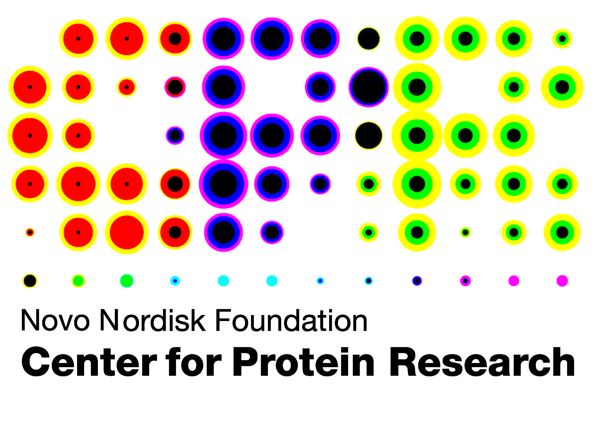

```{r run on server, include= FALSE}
# Run locally or on server
# Input arguments: "local", "server"
run_type <- "local"

if(run_type == "local"){
  run_locally <- TRUE
  run_on_server <- FALSE
  } else if (run_type == "server"){
    run_locally <- FALSE
    run_on_server <- TRUE
    }
```


```{r read arguments, include = FALSE, eval = run_on_server}
# Troels' addition:
args <- commandArgs(trailingOnly=TRUE)
n_args <- length(args)
rand_num <- args[1]
```

```{r chunk setup - local, include = FALSE, eval = TRUE, eval = run_locally}
knitr::opts_chunk$set(warning = FALSE, 
                      message = FALSE,
                      error = TRUE,
                      echo = FALSE,
                      fig.align = "center", 
                      fig.width = 10,
                      fig.retina = 3,
                      fig.path = "plots/",
                      dev = c("png", "cairo_pdf"), 
                      optipng = "-o7"
                      )

options(knitr.table.format = "html") 
```

```{r chunk setup - server, include = FALSE, eval = TRUE, eval = run_on_server}
knitr::opts_chunk$set(warning = FALSE, 
                      message = FALSE,
                      error = TRUE,
                      echo = FALSE,
                      fig.align = "center", 
                      fig.width = 10,
                      fig.retina = 3,
                      fig.path = paste(rand_num,"/plots/", sep=""), # Troels edit
                      dev = c("png", "cairo_pdf"), 
                      optipng = "-o7"
                      )

options(knitr.table.format = "html") 
```


```{r load packages, results = 'hide'}
# General
library(tidyverse) # data wrangling, graphs, etc.
library(janitor) # data cleaning
library(knitr) # Rmarkdown functions
# library(plyr) # Rounding for WGR_colplot_* functions

# Excel files
library(readxl) # read in excel files
library(writexl) # save tables as xlsx format

# Tables
library(kableExtra) # tables in Rmarkdown
library(formattable) # extra features for tables in Rmarkdown

# ggplots
library(ggrepel) # annotation in ggplots
library(RColorBrewer) # extended color palette
library(ggnewscale) # enables multiple color scales on plot
library(patchwork) # plot ggplots in panels
library(Cairo) # save unicode symbols in figures

# PPI-plots
library(ggraph) # protein-protein interaction (PPI) network
library(tidygraph) # protein-protein interaction (PPI) network

# statistics
library(EnvStats) # calculate geometric means
library(WebGestaltR) # GO term analysis

source(here::here("scripts","functions.R")) # customized functions
```


```{r User-defined settings - local, results = 'hide', echo = FALSE, eval = run_locally}
# Local directory containing code/data
data_dir <- here::here("data/")
source(here::here("report_input", "custom_settings.R")) # Local setting
```

```{r User-defined settings - server, results = 'hide', echo = FALSE, eval = run_on_server}
# Local directory containing code/data
data_dir <- here::here("data/")
source(here::here("report_input", "custom_settings.R"))
```


# Identified targets {.unnumbered}

```{r load data, results = 'hide', echo = FALSE}
# resource date
biomarker_list <- read_tsv(str_c(data_dir, "prepped_data/", "biomarker_list_prepped.tsv")) 
known_biomarkers_list <- read_tsv(str_c(data_dir, "prepped_data/", "known_biomarkers_list_prepped.tsv"))
text_mining_data <- read_tsv(str_c(data_dir, "prepped_data/", "textmining_results_prepped.tsv"))
uniprot_mapping <- read_tsv(str_c(data_dir, "prepped_data/", "uniprot_mapping_file_mousehuman.tsv"))
ppi_data <- readRDS(str_c(data_dir, "prepped_data/", "string_ppi_data_prepped.Rds"))
ppi_enriched_gene_sets <- read_tsv(str_c(data_dir, "ppi_geneset_precalc_STRING/", "all_databases_only_enriched.tsv"))
drugbank_data <- read_tsv(str_c(data_dir, "prepped_data/", "drugbank_data_prepped.tsv"))

# RHAPSODY data 
ref_exp_file <- read_tsv(str_c(data_dir, "prepped_data/", "data_BCDP_rhapsody_prepped.tsv"))
meta_exp_file <- read_tsv(str_c(data_dir, "prepped_data/", "RHAPSODY_rank_metaanalysis_all.tsv"))
```

```{r load candidate list - local, results = 'hide', echo = FALSE, eval = run_locally}
# example for paper
my_list <- scan(str_c(data_dir, "example_data/", "RHAPSODY_candidates_uniprot.csv"), sep=',', what = "", quiet = TRUE) %>%
  as_tibble() %>%
  left_join(., uniprot_mapping, by = c("value" = "uniprot_all")) %>%
  distinct(uniprot)

# # Troels' uniprot ID's
# my_list <- scan(str_c(data_dir, "example_data/", "troels_uniprot_ids.csv"), sep=',', what = "", quiet = TRUE) %>%
#   as_tibble() %>%
#   left_join(., uniprot_mapping, by = c("value" = "uniprot_all")) %>%
#   distinct(uniprot)

# # Drugbank targets
# my_list <- scan(str_c(data_dir, "example_data/", "drugbank_uniprot_ids.csv"), sep=',', what = "", quiet = TRUE) %>%
#   as_tibble() %>%
#   left_join(., uniprot_mapping, by = c("value" = "uniprot_all")) %>%
#   distinct(uniprot)

# Error on meta rank 
# my_list <- scan(str_c(data_dir, "example_data/", "report_error.csv"), sep=',', what = "", quiet = TRUE) %>%
#   as_tibble() %>%
#   left_join(., uniprot_mapping, by = c("value" = "uniprot_all")) %>%
#   distinct(uniprot)

```

```{r load candidate list - server, results = 'hide', echo = FALSE, eval = run_on_server}
my_list <- args[2:n_args] %>%
  as_tibble() %>%
  left_join(., uniprot_mapping, by = c("value" = "uniprot_all")) %>%
  distinct(uniprot)
```


**Load list of proteins for prioritization**

```{r your data, results = 'hide'}
my_list_mapped <- my_list %>% 
  left_join(., uniprot_mapping) %>% 
  distinct(uniprot, uniprotkb_id, gene_name) %>% 
  mutate(target = ifelse(!is.na(gene_name), gene_name, uniprotkb_id))

## Experimental data
ref_exp <- ref_exp_file %>% 
  select(-p_value) %>% 
  rename(.,
         p_value = adj_p_val,
         effect = log_fc,
         omics_type = omics,
         experiment_PI = source) %>% 
  mutate(threshold = as.factor(p_value < p_value_threshold),
         # omics_type = factor(omics_type, c("Transcriptomics", "Proteomics"))
         )


# Merge with key proteins and experiment properties
my_protein_list <- my_list_mapped %>% 
  left_join(., ref_exp) 


# Data frame with selected hits according to the specified threshold.
# Two data frame is made. One with all entries for the hits (my_hits_exp) and one with the "best" hit, based on lowest p-value (my_hits_bmk)
numhits_threshold <- my_protein_list %>% 
  group_by(target) %>% 
  filter(any(threshold == TRUE)) %>% 
  ungroup() %>% 
  distinct(target) %>% 
  nrow()

my_hits_exp <- my_protein_list %>% 
  mutate(numhits_threshold = numhits_threshold) %>% 
  filter(if_else(numhits_threshold >= min_num_hits, threshold == TRUE, TRUE)) %>% 
  select(target, uniprot, p_value, effect, omics_type, everything()) %>% 
  mutate(omics_type = as.character(omics_type),
         ) %>% 
  filter(!is.na(experiment_name))

my_hits_bmk <- my_protein_list %>% 
  mutate(numhits_threshold = numhits_threshold) %>% 
  filter(if_else(numhits_threshold >= min_num_hits, threshold == TRUE, TRUE)) %>% 
  distinct(uniprot) %>% 
  left_join(., biomarker_list) %>% 
  mutate(target = ifelse(!is.na(uniprot_gene), uniprot_gene, uniprotkb_id), .before = everything())  %>% 
  left_join(., meta_exp_file %>% rename(meta_rank = rank)) %>% 
  left_join(., text_mining_data)

```

```{r found genes}
all_genes <- my_list %>% distinct() %>% arrange(uniprot) %>% pull()

genes_with_uniprot <- my_protein_list %>% filter(!is.na(uniprot)) %>% arrange(uniprot) %>% distinct(target) %>% pull()
```


Out of your selected genes:

`r all_genes`

the following targets was matched in our database to the gene names:

`r genes_with_uniprot`

```{r figure setup based on hits, results = "hide", eval = TRUE}
# include = FALSE,
legend_space <- 1.5

num_targets_exp <- my_hits_exp %>% filter(!is.na(p_value)) %>% distinct(target) %>% nrow()
num_targets_total <-  my_hits_exp %>% distinct(target) %>% nrow()
num_omics <- my_hits_exp %>% filter(!is.na(p_value)) %>% distinct(omics_type) %>% nrow()
num_species <- my_hits_exp %>% filter(!is.na(p_value)) %>% distinct(species) %>% nrow()

species_vector <- my_hits_exp %>% distinct(species) %>% filter(!is.na(species)) %>% pull(species)

table_sizes <- list(
  h_table_large_exp = if_else(num_targets_exp <= 8, str_c(num_targets_exp * 50 + 200, "px"), str_c(850, "px")),
  h_table_large_total = if_else(num_targets_total <= 8, str_c(num_targets_total * 40 + 330, "px"), str_c(650, "px")),
  # h_table_small_interpartners = if_else(num_targets_total <= 30, str_c(num_targets_total * 20 + 250, "px"), str_c(650, "px")),
  h_table_small = if_else(num_targets_total <= 30, str_c(num_targets_total * 15 + 200, "px"), str_c(500, "px"))

)

figure_sizes <- list(
  # heights
  h_targetfacet_3cols = if_else(num_targets_total == 1, 2.5 + legend_space, ceiling(num_targets_total/3) * 2 + legend_space),
  h_acrosstargets_tissuescatter = if_else(num_targets_total <= 8, num_species * 2 + legend_space, num_targets_total * 1.25 + legend_space),
  h_acrossspecies_tissuescatter =  num_targets_total * 1.25 + legend_space,
  h_target_lollipop_bar = num_targets_total * 0.35 + 1,
  h_target_barplot = num_targets_total * 0.4 + legend_space,
  h_target_ppi = num_targets_total * 3 + legend_space,
  h_target_volcano = 5,
  
  # widths
  w_acrosstarget_tissuescatter = case_when(num_targets_total < 5 ~ num_targets_total * 2.5, 
                                           num_targets_total %in% c(5:8) ~ 10,
                                           num_targets_total > 8 ~ num_species * 3),
  w_acrossspecies_tissuescatter = num_species * 3
)

```

# Functional information <a id="1"></a>

## Target overview {.tabset .tabset-fade .tabset-pills}

### Table {.unnumbered}

```{r target-overview}
targetoverview_data <- my_hits_bmk %>% 
  select(target, 
         "Gene synonyms" = hpa_gene_synonyms,
         "Protein name" = uniprot_protein_name,
         "UniProt ID" = uniprot,
         "Subcellular location" = hpa_subcellular_location, 
         "Protein family" = pharos_protein_family,
         "Protein class" = hpa_protein_class,
         "Target development level" = pharos_tdl, 
         ) %>% 
  mutate(`Subcellular location` = str_replace_all(`Subcellular location`, pattern = ",", ", "),
         `Protein name` = str_extract(`Protein name`, "^[^\\(]+") %>% str_trim(),
         protein_name_length = str_count(`Protein name`)
         ) %>% 
  mutate(`Protein name` = case_when(protein_name_length >= 40 ~ str_replace_all(`Protein name`, "/", "/ "),
                                    TRUE ~ `Protein name`),
         .keep = "unused"
         ) %>% 
  mutate(across(everything(), str_replace_na),
         across(everything(), ~str_replace(.,"^NA$|^NaN$|^-$", "\\—"))) %>% 
  arrange(target)

targetoverview_table <- targetoverview_data %>% 
  mutate(`UniProt ID` = cell_spec(`UniProt ID`, "html", link = str_c("https://www.uniprot.org/uniprot/", `UniProt ID`)),
         `Target development level` = recode(`Target development level`,
                                             Tclin = cell_spec("Tclin", background = "#4678B2", color = "white"),
                                             Tchem = cell_spec("Tchem", background = "#75BEDB", color = "white"),
                                             Tbio = cell_spec("Tbio", background = "#F4B569", color = "white"),
                                             Tdark = cell_spec("Tdark", background = "#E15241", color = "white")),
         ) %>%
  kable(col.names = c("", targetoverview_data %>% select(-target) %>% colnames()),
        align = "c", 
        escape = F, 
        caption = "Target overview"
        ) %>% 
  kable_styling(bootstrap_options = c("striped", "hover", "condensed")) 

# Show table with scrollbox
targetoverview_table %>%
  scroll_box(width = "100%", height = table_sizes$h_table_large_total)
```

```{r target-overview-local, eval = run_locally}
# Save table as png-file
targetoverview_table %>%
  save_kable(file = "tables/table1_target_overview.png")

# Save table as excel-file
targetoverview_data %>%
  mutate(`UniProt ID link` = str_c("https://www.uniprot.org/uniprot/", `UniProt ID`)) %>% 
  write_xlsx(path = "tables/table1_target_overview.xlsx")
```

```{r target-overview-server, eval = run_on_server}
# Save table as png-file
targetoverview_table %>%
  save_kable(file = str_c(rand_num,"/tables/table1_target_overview.png"))

# Save table as excel-file
targetoverview_data %>%
  mutate(`UniProt ID link` = str_c("https://www.uniprot.org/uniprot/", `UniProt ID`)) %>%
  write_xlsx(path = str_c(rand_num,"/tables/table1_target_overview.xlsx"))
```

### About {.unnumbered}

Table content:

-   **Protein name (UniProt)**: Name of gene product.\  

-   **Gene synonyms (HPA)**: A list of different synonyms (in uppercase) for the (official) gene name provided by HPA.\  

-   **UniProt ID (UniProt)**: Link to UniProt for additional information on the target.\  

-   **Protein class (HPA)**: Classification of the protein target based on function and cellular compartment and/or disease and drug related
    information.\  

-   **Subcellular location (HPA)**: HPA-assigned subcellular location.\  

-   **Protein family (PHAROS)**: Protein family the target is assigned to.\  
    Levels: GPCR, Nuclear Receptor, Kinase, Enzyme, Ion Channel,
    Transcription Factor, Transporter, Epigenetic, oGPCR, TF/Epigenetic,
    Non-IDG.\
    Special emphasis is given on four superfamilies that are central to
    the NIH IDG initiative: GPCRs, kinases, ion channels, and nuclear
    receptors.\  

-   **Target development level (PHAROS)**: Target Development Level (TDL) (for more information on TDL see [here](http://juniper.health.unm.edu/tcrd/)).\ 
    TDL categorizes the target based on known information and potential drugability, with descending ranking:\  
    -   Tclin: Approved drugs with known mechanism of action.\  
    -   Tchem: If associated with small molecule activities in ChEMBL or
        DrugCentral.\  
    -   Tbio: If not associated with small molecule or drug activities,
        but have a GO Molecular Function or Biological Process leaf
        term(s) with an Experimental Evidence code or/and have a
        confirmed OMIM phenotype.\  
    -   Tdark: If not known drug or small molecule activities, and
        PubMed text-mining score from Jensen Lab <5 or/and ≥3 Gene
        RIFs or/and ≥50 Antibodies available on
        <http://antibodypedia.com>.\  


\newline

em-dash (---) indicates that no information was available for the target.


## Functionality descriptions {.tabset .tabset-fade .tabset-pills}

### Table {.unnumbered}

```{r protein-description, eval = TRUE}
descriptions_data <- my_hits_bmk %>%
  left_join(., known_biomarkers_list %>% select(uniprot, suggested_biomarker = source)) %>% 
  mutate(suggested_biomarker = ifelse(is.na(suggested_biomarker), "No", suggested_biomarker)) %>% 
  select(target, 
         "Functionality description" = pharos_protein_description_long,
         "Diabetes associations" = opentargets_assoc_label, 
         "Suggested biomarker" = suggested_biomarker
         ) %>% 
  mutate(`Functionality description` = str_replace_na(`Functionality description`) %>% str_replace("NA", "Description missing")) %>% 
  mutate(across(everything(), str_replace_na),
         across(everything(), ~str_replace(.,"^NA$|^NaN$|^-$", "\\—"))) %>% 
  arrange(target)

descriptions_table <-descriptions_data %>% 
  mutate(.,
         `Suggested biomarker` = case_when(`Suggested biomarker` != "No" ~ cell_spec(`Suggested biomarker`, background = "darkred", color = "white"),
                                           `Suggested biomarker` == "No" ~ cell_spec(`Suggested biomarker`, background = "darkgray", color = "white"))
         ) %>% 
  kable(col.names = c("", descriptions_data %>% select(-target) %>% colnames()),
        escape = F,
        align = "llcc",
        caption = "Functionality description",
        ) %>% 
  kable_styling(bootstrap_options = c("striped", "hover", "condensed")) 

# Show table with scrollbox
descriptions_table %>%
  scroll_box(width = "100%", height = table_sizes$h_table_large_total)
```

```{r protein-description-local, eval = run_locally}
# Save table as png-file
descriptions_table %>%
  save_kable(file = "tables/table2_functionality_description.png")

# Save table as excel-file
descriptions_data %>% 
  write_xlsx(path = "tables/table2_functionality_description.xlsx")
```

```{r protein-description-server, eval = run_on_server}
# Save table as png-file
descriptions_table %>%
  save_kable(file = str_c(rand_num,"/tables/table2_functionality_description.png"))

# Save table as excel-file
descriptions_data %>% 
  write_xlsx(path = str_c(rand_num,"/tables/table2_functionality_description.xlsx"))
```


### About {.unnumbered}

Table content: \  

-   **Description (PHAROS)**: Full-text description of the role/function of the protein from PHAROS.\  

-   **Diabetes associations (Open Targets)**: Gene-disease (diabetes mellitus) association through experiments or clinical trials. Direct associations with T1DM, T2DM and GDM are shown specifically, while all other diabetes mellitus diseases are included in "Other". \  

-   **Suggested biomarker**: Known and suggested biomarkers from [Abbasi et al, 2016](https://journals.plos.org/plosone/article?id=10.1371/journal.pone.0163721),
    RHAPSODY partners (collected by the RHAPSODY biomarker taskforce) and based on PPI-network analysis of known biomarkers (in-house analysis).\  


\newline  

*"Description missing"* indicates that no description was available for the target.


# Experimental evidence <a id="2"></a>

## Volcano plots exploring p-value and effect size relationships

### All experimental results for each hit {.tabset .tabset-fade .tabset-pills}
#### Plot {.unnumbered}

```{r figure1_volcanoplot-all-experiments, fig.height = figure_sizes$h_targetfacet_3cols,  fig.cap = "Volcano plot - all experiments"}
volcano_significant_all <- my_hits_exp %>% 
  mutate(p_value = -log10(p_value)) %>% 
  mutate(threshold = as.factor(threshold)) 

volcano_significant_all %>% 
  ggplot(aes(x = effect, y = p_value)) +
  labs(x = expression("log"[10]~"fold change"), y = expression("-log"[10]~"adj. p-value"), title = "") +
  geom_point(aes(color = threshold, 
                 alpha = threshold, 
                 shape = omics_type),
             size = 2) + 
  scale_color_manual(breaks = c("TRUE", "FALSE"),
                     values = c(figure_colors$p_threshold_true, figure_colors$p_threshold_false),
                     labels = c(str_c("p-value < ", p_value_threshold), str_c("p-value ≥ ", p_value_threshold)),
                     drop = FALSE,
                     guide = guide_legend(override.aes = list(shape = "square", size = 5))
                     ) +
  scale_alpha_manual(breaks = c("TRUE", "FALSE"),
                     values = c(0.8, 0.5),
                     labels = c(str_c("p-value < ", p_value_threshold), str_c("p-value ≥ ", p_value_threshold)),
                     drop = FALSE,
                     guide = guide_legend(override.aes = list(shape = "square", size = 5))
                     ) +
  scale_shape_manual(breaks = c("Proteomics", "Transcriptomics"),
                     values = c("circle", "square"),
                     guide = guide_legend(override.aes = list(color = "gray", size = 3),
                                          )) +
  facet_wrap(~target, scales = "free") +
  theme(legend.position = "top",
        legend.box = "horizontal",
        legend.direction = "vertical",
        legend.title = element_blank(),
        legend.spacing.y = unit(-0.2, "cm"),  
        plot.margin = unit(c(0.5,1.5,0.5,0.5), "cm")
        ) + 
  coord_cartesian(xlim = range(volcano_significant_all$effect), 
                  ylim = range(volcano_significant_all$p_value)) + 
  scale_x_continuous(expand = c(.15,.15)) + 
  scale_y_continuous(expand = c(.15,.15)) 

```

#### About {.unnumbered}

Individual volcano plots for each target with results from all RHAPSODY experiments plotted.\  

-   Shape: Points are shaped according to omics type.\  
-   Color: Points with an adjusted p-value <`r p_value_threshold` are shown in `r text_spec(about_text$text_p_threshold_true, color = about_text$color_p_threshold_true, bold = TRUE)`, 
    while non-significant points are shown in `r text_spec(about_text$text_p_threshold_false, color = about_text$color_p_threshold_false, bold = TRUE)`.\  

Empty plots indicates that the specific target were not measured in RHAPSODY experiments.\  

### Compare best experimental result for each target based on p-value {.tabset .tabset-fade .tabset-pills}

#### Plot {.unnumbered}
```{r figure2_volcanoplot-bestresults, fig.height = figure_sizes$h_target_volcano, fig.cap = "Volcano plot - Best results from each target"}
volcano_significant <- my_hits_exp %>%
  select(-c(uniprot, uniprotkb_id)) %>% 
  distinct_all() %>% 
  group_by(target, omics_type) %>% 
  slice_min(p_value) %>% 
  mutate(p_value = -log10(p_value)) %>% 
  mutate(threshold = as.factor(threshold)) 

volcano_ref <- ref_exp %>% 
  filter(omics_type %in% volcano_significant$omics_type) %>% 
  group_by(uniprot, omics_type) %>% 
  slice_min(p_value)  %>% 
  mutate(p_value = -log10(p_value)) 

volcano_significant %>%
  ggplot(aes(x = effect, y = p_value, shape = omics_type)) +
  labs(x = expression("log"[10]~"fold change"), y = expression("-log"[10]~"adj. p-value"), title = "") +
  geom_point(data = volcano_ref, 
             aes(x = effect, y = p_value, shape = omics_type), alpha = 0.2, color = figure_colors$background_points) + 
  geom_point(aes(color = threshold),
             size = 2.5) + 
  geom_text_repel(aes(label = target, color = threshold), 
                  vjust = "outward", 
                  hjust = "outward", 
                  show.legend = FALSE, 
                  size = 3) +
  scale_color_manual(breaks = c("TRUE", "FALSE"),
                     values = c(figure_colors$p_threshold_true, figure_colors$p_threshold_false),
                     labels = c(str_c("p-value < ", p_value_threshold), str_c("p-value ≥ ", p_value_threshold)),
                     drop = FALSE,
                     guide = guide_legend(override.aes = list(shape = "square", size = 5))
                     ) +
  scale_shape_manual(breaks = c("Proteomics", "Transcriptomics"),
                     values = c("circle", "square"),
                     guide = guide_legend(override.aes = list(color = figure_colors$omics_legend_overwrite, size = 3))
                     ) +
  facet_wrap(~factor(omics_type, c("Proteomics", "Transcriptomics")), 
             scales = "free", 
             ncol = 2) +
  theme(legend.position = "top",
        legend.box = "horizontal",
        legend.direction = "vertical",
        legend.title = element_blank(),
        strip.text = element_text(size = 12),
        plot.margin = unit(c(0,0.5,0.5,0.5), "cm"), 
        axis.title = element_text(size = 10),
        axis.text = element_text(size = 10),
        panel.spacing.x = unit(2, "lines")
        ) 
```

#### Table {.unnumbered}
```{r table-bestresults-experimental}
ranklist_omics_data <- my_hits_exp %>% 
  group_by(target, omics_type) %>% 
  slice_min(p_value) %>%
  ungroup() %>% 
  mutate(effect = formatC(round(effect, 3), format = "f", digits = 3),
         p_value = if_else(p_value < 0.001, formatC(p_value, format = "e", digits = 2), formatC(round(p_value, 3), format = "f", digits = 3)),
         tissue = recode(tissue, Islets_LCM = "Islets LCM")) %>% 
  arrange(omics_type, as.numeric(p_value)) %>% 
  select(.,
         `Omics type` = omics_type, 
         Target = target, 
         Experiment = experiment, 
         Tissue = tissue, 
         Comparison = comparison, 
         `log10 fold change` = effect,
         `Adj. p-value` = p_value
         ) %>% 
  distinct_all()

ranklist_omics_table <- ranklist_omics_data %>% 
  select(-`Omics type`) %>%
  mutate(across(everything(), ~cell_spec(., 
                                         color = if_else(as.numeric(`Adj. p-value`) < 0.05, table_colors$text_p_treshold_true, table_colors$text_p_treshold_false),
                                         bold =  if_else(as.numeric(`Adj. p-value`) < 0.05, TRUE, FALSE)))) %>% 
  kable(col.names = c("", "Experiment", "Tissue", "Comparison", "log10 fold change", "Adj. p-value"), 
        escape = FALSE, 
        caption = "Best experimental results for each target by omics-type") %>% 
  kable_styling(bootstrap_options = c("striped", "hover", "condensed")) %>% 
  pack_rows(index = ranklist_omics_data  %>% pull(`Omics type`) %>% table())

# Show table with scrollbox
ranklist_omics_table  %>%
  scroll_box(width = "100%", height = table_sizes$h_table_large_exp)
```

```{r table-bestresults-experimental-local, eval = run_locally}
# Save table as png-file
ranklist_omics_table %>%
  save_kable(file = "tables/table3_best_experimental_results_by_omics.png")

# Save table as excel-file
ranklist_omics_data %>% 
  write_xlsx(path = "tables/table3_best_experimental_results_by_omics.xlsx")
```

```{r table-bestresults-experimental-server, eval = run_on_server}
# Save table as png-file
ranklist_omics_table %>%
  save_kable(file = str_c(rand_num,"/tables/table3_best_experimental_results_by_omics.png"))

# Save table as excel-file
ranklist_omics_data %>% 
  write_xlsx(path = str_c(rand_num,"/tables/table3_best_experimental_results_by_omics.xlsx"))
```


#### About {.unnumbered}

Omics-specific volcano plots with the best result for each tissue based on lowest adjusted p-value. 
Best results (lowest adjusted p-value) for all targets is shown as background points.\  

-   Shape: Points are shaped according to omics type.\  
-   Color: Points with an adjusted p-value <`r p_value_threshold` are shown in `r text_spec(about_text$text_p_threshold_true, color = about_text$color_p_threshold_true, bold = TRUE)`, 
    while non-significant points are shown in `r text_spec(about_text$text_p_threshold_false, color = about_text$color_p_threshold_false, bold = TRUE)`.\  
-   Background: The best results for all targets detected in RHAPSODY experiments are included as a reference background in light gray with a reduced size.\  

\newline

The best results from each target is shown in a table format together with the experiment-specific information, including:

-   **Experiment**: Experimental setting within the RHAPSODY consortium. Find more information on the experiments
    [here](https://docs.google.com/spreadsheets/d/18Xx9HGK3B-LlqYymG4oD74MsAsFADUOaCNh3NyCszTE/edit#gid=16079932).\  
-   **Tissue**: The tissue the target was detected in. The tissue availability is omics dependent:\  
    -   Adipose tissue: Transcriptomics.\  
    -   Blood: Proteomics.\  
    -   Islets: Transcriptomics.\  
    -   Islets LCM (laser capture microdissected): Transcriptomics.\  
    -   Liver: Transcriptomics.\  
    -   Muscles: Transcriptomics.\  
-   **Comparison**: Experimental setup or modeling.\  
-   **log10 fold change**: log10-transformed fold change (FC).\  
-   **Adj. p-value**: FDR adjusted p-value.\  

Significant results with an adjusted p-value <`r p_value_threshold` are shown in [**blue**]{style="color:#00688B"}, while non-significant points are shown in [**gray**]{style="color:gray"}.\  

## RHAPSODY meta rank  {.tabset .tabset-fade .tabset-pills}

### Table {.unnumbered}
```{r meta_analysis}
meta_analysis_table <- my_hits_bmk %>% 
  distinct(target, meta_p_adjust, found_in_blood, meta_rank) %>%
  mutate(.,
         found_in_blood = as.character(found_in_blood)) %>% 
  nest(table_data = everything()) %>% 
  mutate(prep_format = map(table_data, ~.x %>% 
                             mutate(meta_p_adjust = case_when(meta_p_adjust < 0.001 & !is.na(meta_p_adjust) ~ formatC(meta_p_adjust, format = "e", digits = 2), 
                                                              meta_p_adjust >= 0.001 & !is.na(meta_p_adjust) ~ formatC(round(meta_p_adjust, 3), format = "f", digits = 3),
                                                              TRUE ~ NA_character_),
                                    found_in_blood = factor(found_in_blood, c(TRUE, FALSE))
                                    ) %>% 
                             select(target, 
                                    `Detected in blood` = found_in_blood, 
                                    `Adj. meta p-value` = meta_p_adjust,
                                    Rank = meta_rank
                                    ) %>% 
                             arrange(Rank, as.numeric(`Adj. meta p-value`), `Detected in blood`) %>% 
                             mutate(across(everything(), str_replace_na),
                                    across(everything(), ~str_replace(.,"^NA$|^NaN$", "\\—")))
                           ),
         prep_style = map(prep_format, ~.x %>% 
                            mutate(.,
                                   `Detected in blood` = case_when(`Detected in blood` == TRUE ~ cell_spec("Yes", background = "#2C915D", color = "white"),
                                                                   `Detected in blood` == FALSE ~ cell_spec("No", background = "#912F38", color = "white"),
                                                                   TRUE ~ `Detected in blood`),
                                   Rank = color_tile(table_colors$color_bar_p_threshold_true, table_colors$color_bar_p_threshold_false)(Rank),
                                   across(c(target, `Adj. meta p-value`),  
                                          ~cell_spec(., 
                                                     color = case_when(as.numeric(`Adj. meta p-value`) < 0.05 & !is.na(`Adj. meta p-value`) ~ table_colors$text_p_treshold_true,
                                                                       as.numeric(`Adj. meta p-value`) >= 0.05 & !is.na(`Adj. meta p-value`) ~ table_colors$text_p_treshold_false,
                                                                       TRUE ~ table_colors$text_p_treshold_false),
                                                     bold = case_when(as.numeric(`Adj. meta p-value`) < 0.05  & !is.na(`Adj. meta p-value`) ~ TRUE,
                                                                      as.numeric(`Adj. meta p-value`) >= 0.05 & !is.na(`Adj. meta p-value`) ~ FALSE,
                                                                      TRUE ~ FALSE)
                                                     )))
                          
                                   ),
         kbl_table = map2(prep_style, prep_format, ~.x %>%
                            kable(col.names = c("", .x %>% select(-target) %>% colnames()),
                                  escape = FALSE,
                                  caption = "RHAPSODY meta rank",
                                  align = "lcrc"
                               ) %>%
                            kable_styling(bootstrap_options = c("striped", "hover", "condensed")) %>%
                            row_spec(0, align = "c"))
         )  

meta_analysis_table$kbl_table[[1]] %>%
  scroll_box(height = table_sizes$h_table_small,
             width = "100%"
             )
```

```{r meta_analysis-local, eval = run_locally}
# Save table as .png
meta_analysis_table$kbl_table[[1]] %>%
  save_kable(file = "tables/table5_RHAPSODY_meta_rank.png")  
  
# Save table as .xlsx
meta_analysis_table$prep_format[[1]] %>% 
  write_xlsx(path = "tables/table5_RHAPSODY_meta_rank.xlsx")
```

```{r meta_analysis-server, eval = run_on_server}
# Save table as .png
meta_analysis_table$kbl_table[[1]] %>%
  save_kable(file = str_c(rand_num,"/tables/table5_RHAPSODY_meta_rank.png"))
  
# Save table as .xlsx
meta_analysis_table$prep_format[[1]] %>% 
  write_xlsx(path = str_c(rand_num,"/tables/table5_RHAPSODY_meta_rank.xlsx"))
```


### About {.unnumbered}

The RHAPSODY meta rank is made to identify novel targets based on RHAPSODY experimental data. The rank is based on three steps:\  

1. Meta-analysis of p-values from all proteomics and transcriptomics experiments within the RHAPSODY consortium (see the individual results above). The meta-analysis use the sample size-based meta-analysis described by [Willer et al, 2010](https://doi.org/10.1093/bioinformatics/btq340). The reported meta p-values are FDR-adjusted.\  
2. Targets were evaluated on being found in the blood circulation using data from the Human Protein Atlas. Targets found in circulation were included in step 3.\  
3. Targets with a significant meta p-value, defined as meta p-value < 0.05, were inversely ranked according to their co-mentions with diabetes. The best rank of 1 was assigned to the lowest number of co-mentions (zero (0) co-mentions), signifying the most novel biomarker for diabetes.\  

\newline
Significant results with an adjusted meta p-value <`r p_value_threshold` are shown in `r text_spec(about_text$text_p_threshold_true, color = about_text$color_p_threshold_true, bold = TRUE)`, 
while non-significant points are shown in `r text_spec(about_text$text_p_threshold_false, color = about_text$color_p_threshold_false, bold = TRUE)`.\  

\newline
em-dash (---) indicates that no information was available for the target.\  


## Best results within tissue and model {.tabset .tabset-fade .tabset-pills}

### Compare across targets {.unnumbered}

```{r figure3A_comparetissue-acrosstarget, fig.width = figure_sizes$w_acrosstarget_tissuescatter, fig.height = figure_sizes$h_acrosstargets_tissuescatter, fig.cap = "Compare tissue-specific results across targets"}
if (num_targets_total <= 8){
  my_hits_exp %>%
    mutate(species = ifelse(is.na(species), species_vector[1], species)) %>% 
    group_by(target, tissue, species) %>%
    mutate(best = if_else(p_value == min(p_value), TRUE, FALSE),
           tissue = recode(tissue,
                           Islets_LCM = "Islets LCM")) %>%
    ggplot(aes(x = tissue, y = effect)) +
      labs(y = expression("log"[10]~"fold change")) + 
      # geom_line(data = . %>% filter(best == TRUE), 
      #           aes(group = target),
      #           color = "darkgray") +
      geom_point(aes(color = threshold,
                     alpha = threshold,
                     shape = omics_type
                     ),
                 size = 2) +
      scale_color_manual(breaks = c("TRUE", "FALSE"),
                       values = c(figure_colors$p_threshold_true, figure_colors$p_threshold_false),
                       labels = c(str_c("p-value < ", p_value_threshold), str_c("p-value ≥ ", p_value_threshold)),
                       drop = FALSE,
                       guide = guide_legend(override.aes = list(shape = "square", size = 5))
                       ) +
      scale_alpha_manual(breaks = c("TRUE", "FALSE"),
                       values = c(0.8, 0.5),
                       labels = c(str_c("p-value < ", p_value_threshold), str_c("p-value ≥ ", p_value_threshold)),
                       drop = FALSE,
                       guide = guide_legend(override.aes = list(shape = "square", size = 5))
                       ) +
      scale_shape_manual(breaks = c("Proteomics", "Transcriptomics"),
                         values = c("circle", "square"),
                         guide = guide_legend(override.aes = list(color = figure_colors$omics_legend_overwrite, size = 3))) +
      facet_grid(species~target, scales = "free_y") +
      theme(legend.position = "top",
            legend.box = "horizontal",
            legend.direction = "vertical",
            legend.title = element_blank(),
            legend.spacing.y = unit(-0.2, "cm"),
            axis.text.x = element_text(angle = 45, hjust = 1),
            panel.spacing = unit(1, "lines")
            )

  } else {
    
    my_hits_exp %>% 
    mutate(species = ifelse(is.na(species), species_vector[1], species)) %>% 
      group_by(target, tissue, species) %>% 
      mutate(best = if_else(p_value == min(p_value), TRUE, FALSE),
             tissue = recode(tissue, 
                             Islets_LCM = "Islets LCM"),
             tissue = factor(tissue, c("Muscle", "Liver", "Islets LCM", "Islets", "Blood", "Adipose tissue"))) %>% 
      ggplot(aes(x = effect, y = tissue)) + 
      labs(x = expression("log"[10]~"fold change")) + 
      # geom_line(data = . %>% filter(best == TRUE), 
      #           aes(group = target),
      #           color = "darkgray", 
      #           orientation = "y") +
      geom_point(aes(color = threshold,
                   alpha = threshold,
                   shape = omics_type),
                 size = 2)  +
      scale_color_manual(breaks = c("TRUE", "FALSE"),
                     values = c(figure_colors$p_threshold_true, figure_colors$p_threshold_false),
                     labels = c(str_c("p-value < ", p_value_threshold), str_c("p-value ≥ ", p_value_threshold)),
                     drop = FALSE,
                     guide = guide_legend(override.aes = list(shape = "square", size = 5))
                     ) +
      scale_alpha_manual(breaks = c("TRUE", "FALSE"),
                     values = c(0.8, 0.5),
                     labels = c(str_c("p-value < ", p_value_threshold), str_c("p-value ≥ ", p_value_threshold)),
                     drop = FALSE,
                     guide = guide_legend(override.aes = list(shape = "square", size = 5))
                     ) +
      scale_shape_manual(breaks = c("Proteomics", "Transcriptomics"),
                         values = c("circle", "square"),
                         guide = guide_legend(override.aes = list(color = figure_colors$omics_legend_overwrite, size = 3))) +
      facet_grid(target~species) +
      theme(legend.position = "top",
            legend.box = "horizontal",
            legend.direction = "vertical",
            legend.title = element_blank(),
            legend.spacing.y = unit(-0.2, "cm"), 
            strip.placement = "outside",
            panel.spacing = unit(1, "lines")
            ) 
  }


```

### Compare across species {.unnumbered}

```{r figure3B_comparetissue-acrossspecies, fig.width = figure_sizes$w_acrossspecies_tissuescatter, fig.height = figure_sizes$h_acrossspecies_tissuescatter, fig.cap = "Compare tissue-specific results across species"}
# Including all results, but only connecting with best one - long format
my_hits_exp %>%
  mutate(species = ifelse(is.na(species), species_vector[1], species)) %>% 
  group_by(target, tissue, species) %>% 
  mutate(best = if_else(p_value == min(p_value), TRUE, FALSE),
         tissue = recode(tissue, 
                         Islets_LCM = "Islets LCM")) %>% 
  ggplot(aes(x = tissue, y = effect)) + 
  labs(y = expression("log"[10]~"fold change")) + 
  # geom_line(data = . %>% filter(best == TRUE), 
  #             aes(group = target),
  #             color = "darkgray") +
  geom_point(aes(color = threshold,
                 alpha = threshold,
                 shape = omics_type),
             size = 2)  +
  scale_color_manual(breaks = c("TRUE", "FALSE"),
                     values = c(figure_colors$p_threshold_true, figure_colors$p_threshold_false),
                     labels = c(str_c("p-value < ", p_value_threshold), str_c("p-value ≥ ", p_value_threshold)),
                     drop = FALSE,
                     guide = guide_legend(override.aes = list(shape = "square", size = 5))
                     ) +
  scale_alpha_manual(breaks = c("TRUE", "FALSE"),
                     values = c(0.8, 0.5),
                     labels = c(str_c("p-value < ", p_value_threshold), str_c("p-value ≥ ", p_value_threshold)),
                     drop = FALSE,
                     guide = guide_legend(override.aes = list(shape = "square", size = 5))
                     ) +
  scale_shape_manual(breaks = c("Proteomics", "Transcriptomics"),
                     values = c("circle", "square"),
                     guide = guide_legend(override.aes = list(color = figure_colors$omics_legend_overwrite, size = 3))
                     ) +
  facet_grid(target~species) +
  theme(legend.position = "top",
        legend.box = "horizontal",
        legend.direction = "vertical",
        legend.title = element_blank(),
        legend.spacing.y = unit(-0.2, "cm"), 
        axis.text.x = element_text(angle = 45, hjust = 1),
        panel.spacing = unit(1, "lines")
        ) 

```


### Rank list table {.unnumbered}

```{r table-bestresult-comparetissues}
if (num_species > 1) {
  # For human + mouse data
  ranklist_tissue_data <- my_hits_exp %>% 
    group_by(target, omics_type, tissue, species) %>% 
    slice_min(p_value) %>% 
    select(p_value, effect) %>% 
    distinct_all() %>% 
    pivot_wider(names_from = c(species), 
                values_from = c(effect, p_value)) %>% 
    select(target, omics_type, tissue, ends_with("Human"), ends_with("Mouse")) %>%  
    group_by(tissue) %>% 
    arrange(tissue, as.numeric(p_value_Human), as.numeric(p_value_Mouse)) %>% 
    mutate(tissue = recode(tissue, Islets_LCM = "Islets LCM"))
  
  ranklist_tissue_table <- ranklist_tissue_data %>% 
    mutate(across(where(is.numeric), 
                  ~if_else(abs(.) < 0.001, formatC(., format = "e", digits = 2), formatC(round(., 3), format = "f", digits = 3))),
           across(ends_with("Human"), 
                  ~cell_spec(., 
                             bold = if_else(as.numeric(p_value_Human) < 0.05, TRUE, FALSE),
                             color = if_else(as.numeric(p_value_Human) < 0.05 & !is.na(p_value_Human), table_colors$text_p_treshold_true, table_colors$text_p_treshold_false)
                             )),
           across(ends_with("Mouse"), 
                  ~cell_spec(., 
                             bold = if_else(as.numeric(p_value_Mouse) < 0.05, TRUE, FALSE),
                             color = if_else(as.numeric(p_value_Mouse) < 0.05 & !is.na(p_value_Mouse), table_colors$text_p_treshold_true, table_colors$text_p_treshold_false)
                             )),
           across(c(target, omics_type),  
                  ~cell_spec(., 
                             bold = if_else(str_detect(p_value_Human, "bold") | str_detect(p_value_Mouse, "bold"), TRUE, FALSE),
                             color = if_else(str_detect(p_value_Human, "bold") | str_detect(p_value_Mouse, "bold"), table_colors$text_p_treshold_true, table_colors$text_p_treshold_false)
                             )),
           across(c(starts_with("effect"), starts_with("p_value")), 
                  ~ifelse(str_detect(., ">NA<"), "—", .))) %>% 
    ungroup() %>% 
    select(-tissue) %>% 
    kable(col.names = c("", "Omics type", 
                      "log10 fold change", "Adj. p-value",
                      "log10 fold change", "Adj. p-value"), 
        escape = FALSE,
        caption = "Best result for each target based on tissue type", 
        align = "llrrrr"
        ) %>% 
    row_spec(0, align = "c") %>% 
    kable_styling(bootstrap_options = c("striped", "hover", "condensed")) %>% 
    add_header_above(c(" " = 2, 
                       "Human" = 2, 
                       "Mouse" = 2)) %>% 
    pack_rows(index = ranklist_tissue_data %>% mutate(tissue = as.character(tissue)) %>% pull(tissue) %>% table())

} else {
  
  # For only human OR mouse data
  ranklist_tissue_data <- my_hits_exp %>%
    group_by(target, omics_type, tissue) %>% 
    slice_min(p_value) %>% 
    select(p_value, effect) %>%
    distinct_all() %>% 
    group_by(tissue) %>% 
    arrange(tissue, p_value) %>% 
    mutate(tissue = recode(tissue, Islets_LCM = "Islets LCM"))

  ranklist_tissue_table <- ranklist_tissue_data %>%
    mutate(across(where(is.numeric), 
                  ~if_else(abs(.) < 0.001, formatC(., format = "e", digits = 2), formatC(round(., 3), format = "f", digits = 3))),
           across(c(effect, p_value),
                  ~cell_spec(.,
                             bold = ifelse(as.numeric(p_value) < 0.05 & !is.na(p_value), TRUE, FALSE),
                             color = ifelse(as.numeric(p_value) < 0.05 & !is.na(p_value), table_colors$text_p_treshold_true, table_colors$text_p_treshold_false)
                             )),
           across(c(target, omics_type),  
                  ~cell_spec(., 
                             bold = if_else(str_detect(p_value, "bold"), TRUE, FALSE),
                             color = if_else(str_detect(p_value, "bold"), table_colors$text_p_treshold_true, table_colors$text_p_treshold_false)
                             )),
           across(c(starts_with("effect"), starts_with("p_value")), 
                  ~ifelse(str_detect(., ">NA<"), "—", .))) %>% 
    ungroup() %>% 
    select(-tissue) %>% 
    kable(col.names = c("", "Omics type", 
                      "log10 fold change", "Adj. p-value"), 
        escape = FALSE,
        caption = "Best result for each target based on tissue type", 
        align = "llrrrr"
        ) %>% 
    row_spec(0, align = "llcc") %>% 
    kable_styling(bootstrap_options = c("striped", "hover", "condensed")) %>% 
    pack_rows(index = ranklist_tissue_data %>% mutate(tissue = as.character(tissue)) %>% pull(tissue) %>% table()) 
  
}

  
# Show table
ranklist_tissue_table %>%
  scroll_box(width = "100%", height = table_sizes$h_table_large_exp)
```

```{r table-bestresult-comparetissues-local, eval = run_locally}
# Save table as .png
ranklist_tissue_table %>%
  save_kable(file = "tables/table4_best_experimental_results_by_tissue.png")  
  
# Save table as .xlsx
ranklist_tissue_data %>% 
  mutate(across(everything(), str_replace_na),
         across(everything(), ~str_replace(.,"^NA$|^NaN$", "\\—"))) %>% 
  write_xlsx(path = "tables/table4_best_experimental_results_by_tissue.xlsx")
```


```{r table-bestresult-comparetissues-server, eval = run_on_server}
# Save table as .png
ranklist_tissue_table %>%
  save_kable(file = str_c(rand_num,"/tables/table4_best_experimental_results_by_tissue.png")) 

# Save table as .xlsx
ranklist_tissue_data %>% 
  mutate(across(everything(), str_replace_na),
         across(everything(), ~str_replace(.,"^NA$|^NaN$", "\\—"))) %>% 
  write_xlsx(path = str_c(rand_num,"/tables/table4_best_experimental_results_by_tissue.xlsx"))
```


### About {.unnumbered}

#### Compare across targets {.unnumbered}
Comparison of targets across tissues and species. The plot is made to
enable direct comparison between targets. Dependent on the number of
targets, the plot will give target comparisons horizontally (at 8 or
fewer targets) or vertically (more than 8 targets).\  

-   Line: Connects the best results (lowest adjusted p-value) from each tissue. \  
-   Shape: Points are shaped according to omics type. \  
-   Color: Points with an adjusted p-value <`r p_value_threshold` are shown in `r text_spec(about_text$text_p_threshold_true, color = about_text$color_p_threshold_true, bold = TRUE)`, 
    while non-significant points are shown in `r text_spec(about_text$text_p_threshold_false, color = about_text$color_p_threshold_false, bold = TRUE)`.\
-   Color density: Points with a adjusted p-value <`r p_value_threshold` are shown at full density, 
    while points above the p-value threshold are more see-through (lower density). \  

Empty plots indicates that the specific target were not measured in RHAPSODY experiments.\  

#### Compare across species {.unnumbered}   
Comparison of tissues across species for each target. The plot is
made to enable direct comparison between tissues and species for each
target. \  

-   Line: Connects the best results (lowest adjusted p-value) from each
    tissue.\  
-   Shape: Points are shaped according to omics type.\  
-   Color: Points with an adjusted p-value <`r p_value_threshold` are shown in `r text_spec(about_text$text_p_threshold_true, color = about_text$color_p_threshold_true, bold = TRUE)`, 
    while non-significant points are shown in `r text_spec(about_text$text_p_threshold_false, color = about_text$color_p_threshold_false, bold = TRUE)`.\
-   Color density: Points with a adjusted p-value <`r p_value_threshold` are shown at full density, while points above
    the p-value threshold are more see-through (lower density). \  

Empty plots indicates that the specific target were not measured in RHAPSODY experiments.\  
    
#### Rank list table {.unnumbered}
The table summarizes the best results for each tissue and species based on adjusted p-value. 

-   **Omics type**: Omics type
-   **log10 fold change**: log10-transformed fold change (FC).\
-   **Adj. p-value**: FDR adjusted p-value.\

Significant results with an adjusted p-value <`r p_value_threshold` are shown in `r text_spec(about_text$text_p_threshold_true, color = about_text$color_p_threshold_true, bold = TRUE)`, 
while non-significant points are shown in `r text_spec(about_text$text_p_threshold_false, color = about_text$color_p_threshold_false, bold = TRUE)`.\

\newline
em-dash (---) indicates that no information was available for the target.


# Disease association <a id="3"></a>

## Text mining results from public and in-house sources
### Disease association in scientific articles {.tabset .tabset-fade .tabset-pills}

#### Plot {.unnumbered}

```{r figure4_disease-association, fig.height = figure_sizes$h_target_lollipop_bar, fig.cap = "Disease association in scientific articles"}
disease_association_input <- my_hits_bmk %>% 
  select(target,
         # "Knowledge availability\n(PHAROS)" = pharos_knowledge_availability,
         "Jensen score\n(PHAROS)" = pharos_jensenlab_pubmed_score, 
         "PubTator score\n(PHAROS)" = pharos_pubtator_score,
         pubmed_diabetes, 
         pubmed_all_other, 
         fulltext_diabetes, 
         fulltext_all_other) %>% 
  mutate("All diseases co-mentions\n(PubMed)" = pubmed_diabetes + pubmed_all_other,
         "All diseases co-mentions\n(Full-text)" = fulltext_diabetes + fulltext_all_other) %>% 
  select(-starts_with("fulltext"), -starts_with("pubmed"))

GM <- disease_association_input %>% 
  select(-target) %>% 
  rowwise() %>%  
  do(GM = geoMean(unlist(.), na.rm = TRUE)) %>%
  unnest(cols = c(GM)) %>% 
  bind_cols(., disease_association_input) %>% 
  select(GM, target) %>% 
  mutate(GM = ifelse(is.na(GM), 0, GM)) %>% # Importantly, geometric means does not handle 0s as input values. 
  rename("Geometric mean" = GM) 

disease_association <- disease_association_input %>% 
  full_join(., GM) %>% 
  pivot_longer(cols = -target,
               names_to = "field", 
               values_to = "output") %>% 
  mutate(field = fct_relevel(field, "Geometric mean")) %>% 
  group_by(field) %>%
  mutate(target = fct_reorder(target, output),
         highest_score = ifelse(output == max(output) & output != 0, TRUE, FALSE))

disease_association %>% 
  ggplot(aes(x = output, y = target, color = field)) + 
  geom_segment(aes(x=0, xend=output, y=target, yend=target), color = "gray") +
  geom_point(stat = "identity", size = 2, aes(color = highest_score)) + 
  facet_wrap(~field, nrow = 1, scales = "free_x") + 
    theme(
      axis.title = element_blank(),
      strip.text = element_text(size = 9),
      legend.position = "none"
      ) +
  guides(fill = guide_legend(nrow = 4, byrow = TRUE)) +
  scale_color_manual(values = c(figure_colors$p_threshold_true, figure_colors$p_threshold_false),
                     breaks = c(TRUE, FALSE),
                     name = "highest score"
                    )

```

#### About {.unnumbered}
Text mining results for target-disease (any) association based on in-house and PHAROS data.  

-   In-house text-mining \  
    -   UniProt AC - all diseases co-mentions (PubMed): Sum of diabetes and all other diseases co-mentions in PubMed abstracts.\  
    -   UniProt AC - all diseases co-mentions (full-text): Sum of diabetes and all other diseases co-mentions in 15 mio full-text articles.\    

-   PHAROS \  
    -   Jensen Score: Gene-disease association score based on biomedical
        abstracts, taking co-occurrence within and between sentences
        into account. Absolute counts are reported here. For more
        information, see [Pletscher-Frankild et al,
        2015](https://www.sciencedirect.com/science/article/pii/S1046202314003831).\  
    -   PubTator Score: Online tool for curation of PubMed articles.
        Biological entities (chemicals, diseases, genes, mutations, and
        species) are annotated using entity-specific text-mining tools.
        Normalized scores used for ranking in the tool is reported here.
        For more information, see the
        [website](https://www.ncbi.nlm.nih.gov/research/pubtator/index.html)
        and [Wei,
        2013](https://www.ncbi.nlm.nih.gov/pmc/articles/PMC3692066/).\  

\newline

To ease the comparison between the proteins, a geometric mean has been
calculated for the five parameters. Geometric means can be calculated
with the formula:
$GM = \sqrt[n]{x_{1} \cdot x_{2} \cdot ... \cdot x_{n}}$.\  
Using the geometric mean instead of the arithmetic mean (normally known
as mean or average) to summarize our data is beneficial for two reasons:

-   The geometric mean is not affected by the scale of the data. We can
    therefore summarize our data without normalizing it.\  
-   The geometric mean is less sensitive to outliers than the
    arithmetic mean, but still more sensitive than the median.\ 
-   The geometric mean is also more stable than the median, which can change
    dramatically when adding or removing just a few input values if your
    sample size is small.  \  

However, it is important to note that the geometric mean **does not**
handle zeros and negative values. It is therefore not useful for all
data types.\  


### Diabetes fraction of co-mentions {.tabset .tabset-fade .tabset-pills}

#### Plot {.unnumbered}

```{r figure5_disease-comentions, fig.height = figure_sizes$h_target_barplot, fig.cap = "Disease co-mentions"}
# Diabetes fraction
diabetes_fraction <- my_hits_bmk %>% 
  select(target, 
         pubmed_diabetes, 
         pubmed_all_other, 
         fulltext_diabetes, 
         fulltext_all_other) %>% 
  mutate(fulltext_totaldm = fulltext_diabetes) %>% 
  pivot_longer(cols = -target, 
               names_to = "data_type", 
               values_to = "output") %>%
  separate(data_type, c("source", "disease"), sep = "_", remove = TRUE) %>%
  mutate(source = recode(source,
                         fulltext = "Full text articles\nco-mention count",
                         pubmed = "Abstracts (PubMed)\nco-mention count") %>%
           factor(levels = c("Full text articles\nco-mention count", "Abstracts (PubMed)\nco-mention count")),
         disease = disease %>% factor() %>% fct_relevel(.,"totaldm")) %>% 
  group_by(disease) %>% 
  mutate(target = fct_reorder(target, output))

plot_diabetes_fraction <- diabetes_fraction %>% 
  filter(disease != "totaldm") %>% 
  ggplot(aes(y = target, x = output, fill = disease)) +
  geom_bar(stat="identity", position = "stack", alpha = 0.8) + 
  scale_x_continuous(expand = c(0,0)) + 
  facet_wrap(~source) + 
  theme(
      axis.ticks.y = element_blank(),
      axis.line.y = element_blank(),
      axis.title = element_blank(),
      axis.text.y = element_blank(), 
      strip.text = element_text(size = 12),
      strip.placement = "outside",
      legend.text = element_text(size = 10),
      legend.title = element_blank(), 
      legend.spacing.x = unit(0.25, "cm"),
      panel.spacing = unit(2, "lines"), 
      plot.margin = unit(c(0,0.5,0,0), "cm")
      ) +
  guides(fill = guide_legend(nrow = 1, byrow = TRUE)) +
  scale_fill_manual(values = c(figure_colors$diabetes_fractions_diabetes, figure_colors$diabetes_fractions_allother),
                    name = NULL, 
                    breaks = c("diabetes" , "all"), 
                    labels = c("Diabetes", "All other diseases"))

# Diabetes percentage
diabetes_percentage <- my_hits_bmk %>% 
  select(target, 
         fulltext_diabetes, 
         fulltext_all_other) %>% 
  mutate(dm_percentage = (fulltext_diabetes/(fulltext_diabetes + fulltext_all_other))*100,
         dm_percentage = round(dm_percentage, digits = 0) %>% as.integer(),
         Source = "% diabetes\nco-mentions") %>% 
  select(-starts_with("fulltext")) %>% 
  mutate(target = factor(target, levels(diabetes_fraction$target)))
  
plot_diabetes_percentage <- diabetes_percentage %>% 
  mutate(area = pi * (dm_percentage/2)^2) %>% 
  ggplot(aes(y = target,)) +
  geom_point(aes(size = area), x = 0.6, alpha = 0.8, color = figure_colors$diabetes_fractions_diabetes) + 
  scale_size_continuous(range = c(2,12)) + 
  geom_text(aes(label = str_c(dm_percentage, "%"), x = 0.42)) + 
  facet_wrap(~Source) +
  theme(axis.ticks = element_blank(),
        axis.line = element_blank(),
        axis.title = element_blank(),
        axis.text.x = element_blank(),
        strip.text = element_text(size = 12),
        strip.placement = "bottom",
        plot.margin = unit(c(0,0,0,0), "cm")
        ) + 
  scale_x_continuous(limits = c(0.3,0.7)) + 
  guides(size = "none")

plot_diabetes_percentage + plot_diabetes_fraction + 
  plot_layout(widths = c(1,6), guides = "collect") & 
  theme(legend.position = "bottom")
```

#### About {.unnumbered}

The in-house text-mining has been conducted in two modes for PubMed
abstracts and full-text papers:\  

-   UniProt AC - all diseases except diabetes co-mentions\  
-   UniProt AC - diabetes co-mentions\  

Using these text-mining results, we can compare the number of
co-mentions associated with diabetes to all other diseases.\  

The plot is split into three panel (left-to-right):\  

-   A proportional area plot (left panel) shows the percentage of co-mentions in full text articles that are diabetes-related. \  
-   The first bar plot (middle panel) shows the co-mentions count for diabetes in `r text_spec(about_text$text_diabetes_fraction_diabetes, color = about_text$color_diabetes_fraction_diabetes, bold = TRUE)` and the co-mentions count for all diseases *but* diabetes in `r text_spec(about_text$text_diabetes_fraction_allother, color = about_text$color_diabetes_fraction_allother, bold = TRUE)` derived from 15 million full-text articles (in-house resource, see [Westergaard et al. PLoS Computational Biology
    2018](https://journals.plos.org/ploscompbiol/article?id=10.1371/journal.pcbi.1005962)).\  
-   The second bar plot (right panel) shows similar to the middle panel co-mentions count for diabetes in `r text_spec(about_text$text_diabetes_fraction_diabetes, color = about_text$color_diabetes_fraction_diabetes, bold = TRUE)` and the co-mentions count for all diseases *but* diabetes in `r text_spec(about_text$text_diabetes_fraction_allother, color = about_text$color_diabetes_fraction_allother, bold = TRUE)`. The data is obtained from 15 million abstracts (in-house resource, see [Westergaard et al. PLoS Computational Biology 2018](https://doi.org/10.1371/journal.pcbi.1005962)).\  

The plot has been sorted according to highest full-text all diabetes co-mentions.\  


## Open Targets association scores {.tabset .tabset-fade .tabset-pills}

### Diabetes mellitus (EFO_000400) {.unnumbered}

```{r figure6A_DM_EFO_0000400_association_score, fig.height = figure_sizes$h_target_lollipop_bar, fig.cap = "Association score for diabetes mellitus (supergroup)"}
EFO_0000400 <- my_hits_bmk %>% 
  select(target, 
        starts_with("opentargets_supergroup_association")) %>%
  pivot_longer(cols = -target, 
               names_to = "description", 
               values_to = "output") %>%
  mutate(description = str_remove(description, "opentargets_supergroup_association_")) %>% 
  pivot_wider(names_from = description, 
              values_from = output) %>% 
  rename(`Affected Pathway` = affected_pathway,
         `Animal Model` = animal_model, 
         `Genetic Association` = genetic_association, 
         `Known drug` = known_drug, 
         `Literature` = literature, 
         `RNA Expression` = rna_expression, 
         `Somatic Mutation` = somatic_mutation, 
         Overall = overall) %>% 
  pivot_longer(cols = -target, 
               names_to = "field", 
               values_to = "output") %>% 
  mutate(flag = if_else(is.na(output), "not_detected", "detected"),
         output = if_else(is.na(output), min(output, na.rm = TRUE), output)) %>%
  mutate(field = fct_relevel(field, "Overall")) %>%
  group_by(field) %>%
  mutate(target = fct_reorder(target, output),
         highest_score = ifelse(output == max(output) & output != 0, TRUE, FALSE))
         

EFO_0000400 %>%
  ggplot(aes(x = output, y = target)) + 
  geom_segment(aes(x = 0, xend = output, y = target, yend = target),
               color = if_else(EFO_0000400$flag == "not_detected", "white", "gray")) + 
  geom_point(aes(color = highest_score), stat = "identity", size = if_else(EFO_0000400$flag == "not_detected", -1, 2)) + 
  coord_cartesian(xlim = c(0,1)) +
  facet_wrap(~field, nrow = 1) + 
    theme(
      axis.title = element_blank(),
      axis.text.x = element_text(size = 5),
      strip.text = element_text(size = 8),
      legend.position = "none"
      ) +
  guides(fill = guide_legend(nrow = 4, byrow = TRUE)) +
  scale_color_manual(values = c(figure_colors$p_threshold_true, figure_colors$p_threshold_false),
                     breaks = c(TRUE, FALSE),
                     name = "highest score"
                    )
```

### T2DM (MONDO_0005148) {.unnumbered}

```{r figure6B_T2DM_MONDO_0005148_association_score, fig.height = figure_sizes$h_target_lollipop_bar, fig.cap = "Association score for T2DM"}
MONDO_0005148 <- my_hits_bmk %>% 
  select(target, 
        starts_with("opentargets_t2d_association")) %>%
  pivot_longer(cols = -target, 
               names_to = "description", 
               values_to = "output") %>%
  mutate(description = str_remove(description, "opentargets_t2d_association_")) %>% 
  pivot_wider(names_from = description, 
              values_from = output) %>% 
  rename(`Affected Pathway` = affected_pathway,
         `Animal Model` = animal_model, 
         `Genetic Association` = genetic_association, 
         `Known drug` = known_drug, 
         `Literature` = literature, 
         `RNA Expression` = rna_expression, 
         `Somatic Mutation` = somatic_mutation, 
         Overall = overall) %>% 
  pivot_longer(cols = -target, 
               names_to = "field", 
               values_to = "output") %>% 
  mutate(flag = if_else(is.nan(output) | is.na(output), "not_detected", "detected"),
         output = if_else(is.nan(output)| is.na(output), min(output, na.rm = TRUE), output)) %>%
  mutate(field = fct_relevel(field, "Overall")) %>%
  group_by(field) %>%
  mutate(target = fct_reorder(target, output),
         highest_score = ifelse(output == max(output) & output != 0, TRUE, FALSE))
         

MONDO_0005148 %>%
  ggplot(aes(x = output, y = target)) + 
  geom_segment(aes(x = 0, xend = output, y = target, yend = target),
               color = if_else(MONDO_0005148$flag == "not_detected", "white", "gray")) + 
  geom_point(aes(color = highest_score), stat = "identity", size = if_else(MONDO_0005148$flag == "not_detected", -1, 2)) + 
  coord_cartesian(xlim = c(0,1)) +
  facet_wrap(~field, nrow = 1) + 
    theme(
      axis.title = element_blank(),
      axis.text.x = element_text(size = 5),
      strip.text = element_text(size = 8),
      legend.position = "none"
      ) +
  guides(fill = guide_legend(nrow = 4, byrow = TRUE)) +
  scale_color_manual(values = c(figure_colors$p_threshold_true, figure_colors$p_threshold_false),
                     breaks = c(TRUE, FALSE),
                     name = "highest score"
                    )
```

### T1DM (MONDO_0005147) {.unnumbered}

```{r figure6C_T1DM_MONDO_0005147_association_score, fig.height = figure_sizes$h_target_lollipop_bar, fig.cap = "Association score for T1DM"}
MONDO_0005147 <- my_hits_bmk %>% 
  select(target, 
        starts_with("opentargets_t1d_association")) %>%
  pivot_longer(cols = -target, 
               names_to = "description", 
               values_to = "output") %>%
  mutate(description = str_remove(description, "opentargets_t1d_association_")) %>% 
  pivot_wider(names_from = description, 
              values_from = output) %>% 
  rename(`Affected Pathway` = affected_pathway,
         `Animal Model` = animal_model, 
         `Genetic Association` = genetic_association, 
         `Known drug` = known_drug, 
         `Literature` = literature, 
         `RNA Expression` = rna_expression, 
         `Somatic Mutation` = somatic_mutation, 
         Overall = overall) %>% 
  pivot_longer(cols = -target, 
               names_to = "field", 
               values_to = "output") %>% 
  mutate(flag = if_else(is.nan(output) | is.na(output), "not_detected", "detected"),
         output = if_else(is.nan(output)| is.na(output), min(output, na.rm = TRUE), output)) %>%
  mutate(field = fct_relevel(field, "Overall")) %>%
  group_by(field) %>%
  mutate(target = fct_reorder(target, output),
         highest_score = ifelse(output == max(output) & output != 0, TRUE, FALSE))
         

MONDO_0005147 %>%
  ggplot(aes(x = output, y = target)) + 
  geom_segment(aes(x = 0, xend = output, y = target, yend = target),
               color = if_else(MONDO_0005147$flag == "not_detected", "white", "gray")) + 
  geom_point(aes(color = highest_score), stat = "identity", size = if_else(MONDO_0005147$flag == "not_detected", -1, 2)) + 
  coord_cartesian(xlim = c(0,1)) +
  facet_wrap(~field, nrow = 1) + 
    theme(
      axis.title = element_blank(),
      axis.text.x = element_text(size = 5),
      strip.text = element_text(size = 8),
      legend.position = "none"
      ) +
  guides(fill = guide_legend(nrow = 4, byrow = TRUE)) +
  scale_color_manual(values = c(figure_colors$p_threshold_true, figure_colors$p_threshold_false),
                     breaks = c(TRUE, FALSE),
                     name = "highest score"
                    )
```

### GDM (EFO_0004593) {.unnumbered}

```{r figure6C_GDM_EFO_0004593_association_score, fig.height = figure_sizes$h_target_lollipop_bar, fig.cap = "Association score for GDM"}
EFO_0004593 <- my_hits_bmk %>% 
  select(target, 
        starts_with("opentargets_gdm_association")) %>%
  pivot_longer(cols = -target, 
               names_to = "description", 
               values_to = "output") %>%
  mutate(description = str_remove(description, "opentargets_gdm_association_")) %>% 
  pivot_wider(names_from = description, 
              values_from = output) %>% 
  rename(`Affected Pathway` = affected_pathway,
         `Animal Model` = animal_model, 
         `Genetic Association` = genetic_association, 
         `Known drug` = known_drug, 
         `Literature` = literature, 
         `RNA Expression` = rna_expression, 
         `Somatic Mutation` = somatic_mutation, 
         Overall = overall) %>% 
  pivot_longer(cols = -target, 
               names_to = "field", 
               values_to = "output") %>% 
  mutate(flag = if_else(is.nan(output) | is.na(output), "not_detected", "detected"),
         output = if_else(is.nan(output)| is.na(output), min(output, na.rm = TRUE), output)) %>%
  mutate(field = fct_relevel(field, "Overall")) %>%
  group_by(field) %>%
  mutate(target = fct_reorder(target, output),
         highest_score = ifelse(output == max(output) & output != 0, TRUE, FALSE))
         

EFO_0004593 %>%
  ggplot(aes(x = output, y = target)) + 
  geom_segment(aes(x = 0, xend = output, y = target, yend = target),
               color = if_else(EFO_0004593$flag == "not_detected", "white", "gray")) + 
  geom_point(aes(color = highest_score), stat = "identity", size = if_else(EFO_0004593$flag == "not_detected", -1, 2)) + 
  coord_cartesian(xlim = c(0,1)) +
  facet_wrap(~field, nrow = 1) + 
    theme(
      axis.title = element_blank(),
      axis.text.x = element_text(size = 5),
      strip.text = element_text(size = 8),
      legend.position = "none"
      ) +
  guides(fill = guide_legend(nrow = 4, byrow = TRUE)) +
  scale_color_manual(values = c(figure_colors$p_threshold_true, figure_colors$p_threshold_false),
                     breaks = c(TRUE, FALSE),
                     name = "highest score"
                    )
```

### Other diabetes mellitus subtypes {.unnumbered}

```{r figure6D_otherDM_association_score, fig.height = figure_sizes$h_target_lollipop_bar, fig.cap = "Association score for other diabetes mellitus subtypes"}
other_dm <- my_hits_bmk %>% 
  select(target, 
        starts_with("opentargets_other_association")) %>%
  pivot_longer(cols = -target, 
               names_to = "description", 
               values_to = "output") %>%
  mutate(description = str_remove(description, "opentargets_other_association_")) %>% 
  pivot_wider(names_from = description, 
              values_from = output) %>% 
  rename(`Affected Pathway` = affected_pathway,
         `Animal Model` = animal_model, 
         `Genetic Association` = genetic_association, 
         `Known drug` = known_drug, 
         `Literature` = literature, 
         `RNA Expression` = rna_expression, 
         `Somatic Mutation` = somatic_mutation, 
         Overall = overall) %>% 
  pivot_longer(cols = -target, 
               names_to = "field", 
               values_to = "output") %>% 
  mutate(flag = if_else(is.nan(output) | is.na(output), "not_detected", "detected"),
         output = if_else(is.nan(output)| is.na(output), min(output, na.rm = TRUE), output)) %>%
  mutate(field = fct_relevel(field, "Overall")) %>%
  group_by(field) %>%
  mutate(target = fct_reorder(target, output),
         highest_score = ifelse(output == max(output) & output != 0, TRUE, FALSE))
         

other_dm %>%
  ggplot(aes(x = output, y = target)) +
  geom_segment(aes(x = 0, xend = output, y = target, yend = target),
               color = if_else(other_dm$flag == "not_detected", "white", "gray")) + 
  geom_point(aes(color = highest_score), stat = "identity", size = if_else(other_dm$flag == "not_detected", -1, 2)) + 
  coord_cartesian(xlim = c(0,1)) +
  facet_wrap(~field, nrow = 1) + 
    theme(
      axis.title = element_blank(),
      axis.text.x = element_text(size = 5),
      strip.text = element_text(size = 8),
      legend.position = "none"
      ) +
  guides(fill = guide_legend(nrow = 4, byrow = TRUE)) +
  scale_color_manual(values = c(figure_colors$p_threshold_true, figure_colors$p_threshold_false),
                     breaks = c(TRUE, FALSE),
                     name = "highest score"
                    )
```


### About {.unnumbered}
Open Targets association scores for the diabetes mellitus supergroup and selected subtypes.\ 

-   **Diabetes mellitus (EFO_0000400)**: Supergroup for all diabetes mellitus diseases.\ 

-   **T2DM (MONDO_0005148)**: Type 2 diabetes mellitus.\ 

-   **T1DM (MONDO_0005147)**: Type 1 diabetes mellitus.\ 

-   **GDM (EFO_0004593)**: Gestational diabetes mellitus.\  

-   **Other diabetes mellitus subtypes**: Any other diabetes mellitus subgroup than T2DM, T1DM and GDM, e.g., monogenic diabetes mellitus, prediabetes syndrome, and neonatal diabetes mellitus.\  

\newline

The Open Targets association score is a standardized measure reported a
value between 0 and 1. Here, 1 indicates a strong association, while 0
indicates that there is no known association.\ 
The score is calculated with the formula $s = F \cdot S \cdot C$, where $s$ is the score, $F$ is
the frequency i.e. the relative occurrence of a target-disease evidence,
$S$ is the severity i.e. the magnitude or strength of the effect
described by the evidence, and $C$ is the confidence i.e. overall
confidence for the observation that generates the target-disease
evidence. \
The targets are ranked according to the overall association score, summarizing the seven association variables.

Source: [Open Targets Platform Documentation](https://docs.targetvalidation.org/getting-started/scoring).\

\newline


# Mechanistic evidence <a id="4"></a>

## Protein-protein interaction network 

```{r PPI-dataprep}
# ### Data preparation
ppi_AB_all <- ppi_data %>% pluck("ppi_AB_all", 1)

# Additional list of names and UniProt IDs derived from the PPI-data
ppi_names <- ppi_data %>% pluck("ppi_names", 1)

# Detailed scores
ppi_detailed_scores <-  ppi_data %>% pluck("ppi_detailed_scores", 1)

# List of the names and UniProt IDs of all the proteins (~1,200) included in my_protein_list
mapping_proteinlist <- my_hits_bmk %>%
  distinct(target, uniprot)
```

```{r PPI-interactions}
interactions <- my_hits_bmk %>%
  select(myhit_name = target, uniprot) %>% 
  inner_join(ppi_AB_all, ., by = c("A" = "uniprot")) %>% 
  nest(full_data = everything()) %>%
  mutate(join = "hit_data") %>% 
  full_join(., ppi_AB_all %>% nest(full_data = everything()) %>% mutate(join = "ppi_data")) %>% 
  mutate(interactions_InWeb_cutoff = map(full_data, ~.x %>% filter(combined_score > 0.7)), 
         interactions_all = full_data) %>% 
  pivot_longer(cols = -c(full_data, join), 
               names_to = "interaction_type", 
               values_to = "data") %>% 
  select(-full_data) %>% 
  pivot_wider(names_from = join, 
              values_from = data) %>% 
  mutate(int_prim = hit_data,
         int_sec = map2(int_prim, ppi_data, ~.x %>%
                         group_by(myhit_name) %>% 
                         select(myhit_name, B) %>% 
                         inner_join(.y, ., by = c("A" = "B")) %>% 
                         select(A, B, combined_score) %>%
                         inner_join(.x, ., by = c("B" = "B")) %>% 
                         select(myhit_name,
                                A = A.y,
                                B, 
                                combined_score = combined_score.y) %>% 
                          distinct_all()
                          ),
         int_all = map2(int_prim, int_sec, ~full_join(.x, .y) )
         ) 
```

```{r PPI-nodesedges}
nodes_edges <- interactions %>%
  mutate(nodes_a = map(int_prim, ~.x %>% 
                         distinct(myhit_name, A) %>%
                         rename(label = A) %>% 
                         mutate(group = "A") %>% 
                         select(myhit_name, label, group)
                       ),
         nodes_b = map(int_prim, ~.x %>%
                         rename(label = B)  %>% 
                         mutate(group = "B") %>% 
                         mutate(confint_cutoff = ifelse(combined_score <= 0.7, FALSE, TRUE)) %>%
                         select(myhit_name, label, group, confint_cutoff)),
         network_nodes = map2(nodes_a, nodes_b, ~full_join(.x, .y) %>% 
                                select(label, everything())),
         edges_prim = map(int_prim, ~.x %>%
                            select(myhit_name, A, B, combined_score)),
         edges_sec = int_sec,
         edges_all = map2(edges_prim, edges_sec, ~bind_rows(.x, .y) %>% 
                            distinct_all() %>% 
                            mutate(confint_cutoff = if_else(combined_score > 0.7, TRUE, FALSE)) %>% 
                            rename(from = A, to = B)
                          ),
         edges_all_filter = map2(edges_all, network_nodes, ~.x %>% 
                                   left_join(., .y %>% select(-confint_cutoff), by = c("from" = "label", "myhit_name" = "myhit_name")) %>% 
                                   left_join(., .y %>% select(-confint_cutoff), by = c("to" = "label", "myhit_name" = "myhit_name")) %>% 
                                   filter(!is.na(group.x) & !is.na(group.y)) %>% 
                                   select(-starts_with("group"))
                                 )
         ) %>% 
  select(-ends_with("_int"))
```

```{r PPI-graph}
ppi_graph <- nodes_edges %>% 
  mutate(edges_all_filter = map(edges_all_filter, ~.x %>% 
                                  left_join(., ppi_names %>% rename(to_genename = gene_name), by = c("to" = "uniprot")) %>% 
                                  left_join(., ppi_names %>% rename(from_genename  = gene_name), by = c("from" = "uniprot")) %>% 
                                  mutate(from = str_c(myhit_name, "_", from, "_", from_genename),
                                         to = str_c(myhit_name, "_", to, "_", to_genename)) %>%
                                  group_by(myhit_name)),
         network_nodes = map(network_nodes, ~.x %>% 
                               left_join(., ppi_names, by = c("label" = "uniprot")) %>%
                               mutate(label = str_c(myhit_name, "_", label, "_", gene_name),
                                      gene_name = if_else(group == "A" & myhit_name != gene_name, myhit_name, gene_name)))) %>% 
  mutate(graph_tbl = map2(network_nodes, edges_all_filter, ~tbl_graph(nodes = .x, edges = .y, directed = FALSE)),
         graph = map(graph_tbl, ~.x %>%
                       ggraph(layout = "kk") +
                       geom_edge_link(aes(linetype = confint_cutoff), 
                                      color = figure_colors$edges) +
                       geom_node_point(aes(filter = group == "B", color = confint_cutoff),
                                      alpha = 0.8,
                                      size = 3) +
                       geom_node_text(aes(filter = group == "B", label = gene_name), 
                                      color = figure_colors$sec_node_text, size = 4,
                                      vjust = "outward", hjust = "outward") + 
                       geom_node_label(aes(filter = group == "A", label = gene_name), 
                                      color = figure_colors$prim_node_text, size = 5,
                                      ) + 
                       scale_edge_linetype_manual(limits = c("TRUE", "FALSE"),
                                                  values = c("solid", "dashed"), 
                                                  labels = c("High-confidence interaction", "Potential interaction")) +
                       scale_color_manual(limits = c("TRUE", "FALSE"),
                                          values = c(figure_colors$sec_node_confint_true, figure_colors$sec_node_confint_false),
                                          labels = c("High-confidence interaction partner", "Potential interaction partner")) +
                       facet_nodes(~myhit_name, 
                                   scales = "free",
                                   ncol = 1) + 
                       theme(strip.text = element_blank(),
                             legend.position = "top",
                             legend.direction = "vertical",
                             legend.box = "horizontal",
                             legend.title = element_blank(),
                             legend.text = element_text(size = 12),
                             plot.margin = margin(1,1,1,1, "cm")
                             ) + 
                       scale_x_continuous(expand = c(.15,.15)) + 
                       scale_y_continuous(expand = c(.15,.15))  
                     ))
```

```{r PPI-table, eval = TRUE}
ppi_table <- nodes_edges %>%
  select(interaction_type, edges_all) %>% 
  mutate(table = map(edges_all, ~.x %>% 
                       inner_join(., my_hits_bmk %>% distinct(uniprot_gene, uniprot), by = c("from" = "uniprot", "myhit_name"= "uniprot_gene")) %>% 
                       full_join(., my_hits_bmk %>% distinct(uniprot_gene, uniprot), by = c("from" = "uniprot", "myhit_name"= "uniprot_gene")) %>% 
                       left_join(., biomarker_list %>% select(-uniprot_gene), by = c("to" = "uniprot")) %>% 
                       left_join(., known_biomarkers_list %>% select(uniprot, source), by = c("to" = "uniprot")) %>% 
                       left_join(., text_mining_data, by = c("to" = "uniprot")) %>% 
                       left_join(., ppi_names, by = c("to" = "uniprot")) %>% 
                       left_join(., ppi_detailed_scores, by = c("from" = "A", "to" = "B", "combined_score")) %>% 
                       mutate(.,
                              diabetes_perc = (fulltext_diabetes/(fulltext_all_other + fulltext_diabetes))*100,
                                    diabetes_perc_known = ifelse(is.na(diabetes_perc) & is.na(fulltext_diabetes), FALSE, TRUE),
                                    diabetes_perc = case_when(fulltext_diabetes == 0 ~ 0,
                                                              is.na(diabetes_perc) ~ as.numeric(-1),
                                                              TRUE ~ diabetes_perc),
                              suggested_biomarker = ifelse(!is.na(source), source, "No")
                              ) %>% 
                       select(myhit_name, myhit_uniprot = from, interact_name = uniprot_gene, interact_uniprot = to, 
                              combined_score, confint_cutoff, experimental_score, database_score, textmining_score, 
                              diabetes_perc, opentargets_assoc_label, suggested_biomarker) %>% 
                       distinct_all()
                     
                     )
         
         )
```

```{r summary-table, eval = TRUE}
ppi_sum_table <- ppi_table %>% 
  filter(interaction_type == "interactions_all") %>% # filter(status == "full_dataset") %>% 
  mutate(table_sum = map(table, ~.x %>% 
                           select(-interact_name) %>% 
                           distinct_all() %>% 
                           group_by(myhit_name, myhit_uniprot) %>% 
                           mutate(diabetes_perc = str_replace(diabetes_perc, "-1", NA_character_) %>% as.numeric()) %>% 
                           summarise(interact_all = ifelse(all(is.na(interact_uniprot)), 0, n()), 
                                     
                                     # high confidence partners
                                     n_interact_trusted = ifelse(all(is.na(combined_score)), 
                                                                 0,
                                                                 sum(combined_score > 0.7)),

                                     # suggested partners
                                     n_interact_suggested = ifelse(all(is.na(combined_score)), 
                                                                 0,
                                                                 sum(combined_score <= 0.7)),

                                     # mean textmining percentage
                                     mean_diabetes_textmining = mean(diabetes_perc, na.rm = TRUE), 
                                     
                                     # Direct association to diabetes
                                     n_diabetes_direct = sum(opentargets_assoc_label != "-" & !is.na(opentargets_assoc_label)),

                                     # suggested biomarker
                                     n_suggested_bmk = sum(suggested_biomarker != "No"), 
                                     ) 
                           ),
         prep_format = map(table_sum, ~.x %>% 
                             mutate(mean_diabetes_textmining = as.numeric(as.integer(round(mean_diabetes_textmining, 0))),
                                    mean_diabetes_textmining = str_replace_na(mean_diabetes_textmining) %>% str_replace("^NA$|^NaN$","0") %>% as.numeric(),
                                    interact_trusted = n_interact_trusted,
                                    interact_suggested = n_interact_suggested,
                                    diabetes_direct = n_diabetes_direct,
                                    suggested_bmk = n_suggested_bmk
                                    )  %>% 
                             select(
                               "Target" = myhit_name, 
                               "Mean diabetes textmining %" = mean_diabetes_textmining, 
                               "Associated with diabetes" = diabetes_direct, 
                               "Suggested diabetes biomarkers" = suggested_bmk, 
                               "Potential interaction partners" = interact_suggested, 
                               "High-confidence interaction partners" = interact_trusted, 
                               "Total interaction partners" = interact_all
                             )
                             
                           ),
         prep_style = map(prep_format, ~.x  %>% 
                            ungroup() %>% 
                            #arrange(desc(`Total interaction partners`)) %>% 
                            mutate(`Mean diabetes textmining %` = color_bar(color = "#DFDFE2")(as.numeric(`Mean diabetes textmining %`)), 
                                   `Mean diabetes textmining %` = ifelse(str_detect(`Mean diabetes textmining %`, "width: 0.00%"),
                                                                         "—",
                                                                         `Mean diabetes textmining %`)
                                   )
                            ),
         kbl_table = map2(prep_style, prep_format, ~.x %>% 
                             kable(escape = FALSE,
                                   caption = "Protein-protein interaction networks summary",
                                   align = "llrrrrr"
                                 ) %>% 
                              kable_styling(bootstrap_options = c("striped", "hover", "condensed")) %>%
                              row_spec(0, align = "c") 
                         ))

```


```{r interaction_partner_table, eval = TRUE}
interaction_partner_table <- ppi_table %>% 
  mutate(n_edges = map_dbl(edges_all, nrow)) %>% 
  mutate(prep_format = ifelse(n_edges != 0,
                              map(table, ~.x %>% 
                                    filter(!is.na(interact_name)) %>% 
                                    mutate(combined_score = formatC(round(combined_score, 2), format = "f", digits = 2),
                                           database_score = formatC(round(database_score, 2), format = "f", digits = 2),
                                           textmining_score = formatC(round(textmining_score, 2), format = "f", digits = 2),
                                           experimental_score = formatC(round(experimental_score, 2), format = "f", digits = 2),
                                           diabetes_perc = formatC(round(diabetes_perc, 0), format = "f", digits = 0) %>% as.numeric()) %>%
                                    arrange(myhit_name, 
                                            desc(diabetes_perc),
                                            desc(as.numeric(combined_score))) %>% 
                                    mutate(diabetes_perc = ifelse(diabetes_perc == -1, 0, diabetes_perc),
                                           diabetes_perc = as.numeric(diabetes_perc)) %>%
                                    mutate(across(-c(diabetes_perc), str_replace_na),
                                           across(-c(diabetes_perc), ~str_replace(.,"^NA$|^NaN$|^-$", "\\—"))) %>% 
                                    select(
                                      `Target` = myhit_name,
                                      `Interaction partner` = interact_name, 
                                      `UniProt ID` = interact_uniprot, 
                                      `Diabetes textmining %` = diabetes_perc, 
                                      `Diabetes associations` = opentargets_assoc_label, 
                                      `Suggested diabetes biomarker` = suggested_biomarker,
                                      `Experimental score` = experimental_score,
                                      `Database score` = database_score,
                                      `Textmining score` = textmining_score,
                                      `Combined score` = combined_score
                                      ) %>% 
                                    left_join(., .x %>% select(Target = myhit_name, `Interaction partner` = interact_name, confint_cutoff)) %>%
                                    distinct_all()
                                  ),
                              map(table, ~.x %>%
                                    select(
                                      `Target` = myhit_name,
                                      `Interaction partner` = interact_name, 
                                      `UniProt ID` = interact_uniprot, 
                                      `Diabetes textmining %` = diabetes_perc, 
                                      `Diabetes associations` = opentargets_assoc_label, 
                                      `Suggested diabetes biomarker` = suggested_biomarker,
                                      `Experimental score` = experimental_score,
                                      `Database score` = database_score,
                                      `Textmining score` = textmining_score,
                                      `Combined score` = combined_score
                                      ) %>% 
                                    mutate(across(-c(Target), ~str_replace_na(.) %>% str_replace(".{1,}", "\\—")),
                                           confint_cutoff = 1
                                           )
                                  )
                              ),
         prep_style = ifelse(n_edges == 0,
                             map(prep_format,  ~.x),
                             map2(prep_format, table, ~.x %>% 
                                    mutate(., 
                                           `Interaction partner` = cell_spec(`Interaction partner`, 
                                                                             color = ifelse(confint_cutoff == TRUE, table_colors$text_p_treshold_true,
                                                                                            table_colors$text_p_treshold_false),
                                                                             bold = ifelse(confint_cutoff == TRUE, TRUE, FALSE)),
                                           `UniProt ID` = cell_spec(`UniProt ID`, "html", 
                                                                    link = str_c("https://www.uniprot.org/uniprot/", `UniProt ID`)),
                                           `Diabetes textmining %` = ifelse(confint_cutoff == TRUE,
                                                                            color_bar(color = table_colors$color_bar_p_threshold_true)(`Diabetes textmining %`),
                                                                            color_bar(color = table_colors$color_bar_p_threshold_false)(`Diabetes textmining %`)), 
                                           `Diabetes textmining %` = ifelse(str_detect(`Diabetes textmining %`, "width: 0.00%"),
                                                                            "—",
                                                                            `Diabetes textmining %`),
                                           `Suggested diabetes biomarker` = ifelse(`Suggested diabetes biomarker` != "No", 
                                                                                   cell_spec(`Suggested diabetes biomarker`, 
                                                                                             background = "darkred", 
                                                                                             color = "white"), 
                                                                                   cell_spec(`Suggested diabetes biomarker`, 
                                                                                             background = "darkgray", 
                                                                                             color = "white")),
                                           across(c(`Experimental score`, `Database score`, `Textmining score`),
                                                  ~color_tile(table_colors$color_bar_p_threshold_false, table_colors$color_bar_p_threshold_true)(.)
                                                  ),
                                           `Combined score` = ifelse(`Combined score` > 0.7, 
                                                                     cell_spec(`Combined score`, background = table_colors$text_p_treshold_true, color = "white", bold = TRUE),
                                                                     cell_spec(`Combined score`, background = "darkgray", color = "white")
                                                                     )))),
         kbl_table = map2(prep_style, prep_format, ~.x %>% 
                            select(-c(Target, confint_cutoff)) %>% 
                            kable(escape = FALSE,
                                 caption = "Protein-protein interaction partners",
                                 align = "lllcccccc"
                               ) %>% 
                            kable_styling(bootstrap_options = c("striped", "hover", "condensed")) %>%
                            row_spec(0, align = "c") %>%
                            pack_rows(index = .y %>%
                                       mutate(header = Target) %>%
                                       pull(header) %>%
                                       table()) %>% 
                            add_header_above(c(" " = 2, 
                                               "Diabetes association" = 3, 
                                               "Confidence scores for interaction" = 4))
                         )) 

```

### Network plots {.tabset .tabset-fade .tabset-pills}

#### All interactions {.unnumbered}
```{r figure7A_PPInetworks-alledges, fig.height = figure_sizes$h_target_ppi, fig.cap = "PPI networks"}
if(nrow(ppi_graph$edges_all_filter[[2]]) == 0){
  cat("Unfortunately, no interactions were found for any of the selected targets.")
  } else {
    ppi_graph$graph[[2]]
}
```

#### High-confidence interactions only {.unnumbered}
```{r figure7B_PPInetworks-onlyhighconf, fig.height = figure_sizes$h_target_ppi, fig.cap = "PPI networks"}
if(nrow(ppi_graph$edges_all_filter[[1]]) == 0){
  cat("Unfortunately, no high-confidence interactions were found for any of the selected targets.")
  } else {
    ppi_graph$graph[[1]]
}
```

#### Summary table {.unnumbered}
```{r PPI-overview-table, eval = TRUE}
# Show table with scrollbox
ppi_sum_table$kbl_table[[1]] %>%
  scroll_box(width = "100%", height = table_sizes$h_table_small)
```


```{r PPI-overview-table-local, eval = run_locally}
# Save table as png-file
ppi_sum_table$kbl_table[[1]] %>%
  save_kable(file = "tables/table7_ppi_network_summary.png")

# Save table as excel-file
ppi_sum_table$prep_format[[1]] %>%
  write_xlsx(path = "tables/table7_ppi_network_summary.xlsx")
```


```{r PPI-overview-table-server, eval = run_on_server}
# Save table as png-file
ppi_sum_table$kbl_table[[1]] %>%
  save_kable(file = str_c(rand_num,"/tables/table7_ppi_network_summary.png"))

# Save table as excel-file
ppi_sum_table$prep_format[[1]] %>%
  write_xlsx(path = str_c(rand_num,"/tables/table7_ppi_network_summary.xlsx"))
```


#### About {.unnumbered}
Protein-protein interaction networks based on physical links data from the STRING database. See [Szklarczyk et al,
2018](https://academic.oup.com/nar/article/47/D1/D607/5198476) for a description of
the resource.

Network features:  

-   Interaction partners (nodes) are colored according to the confidence score of 
    their interaction with the primary targets.
    -   High confidence interaction partners (confidence score > 0.7) are shown in `r text_spec(about_text$text_p_threshold_true, color = about_text$color_p_threshold_true, bold = TRUE)`
    -   Suggested interaction partners (confidence score ≤ 0.7) are shown in `r text_spec(about_text$text_p_threshold_false, color = about_text$color_p_threshold_false, bold = TRUE)`
-   Interactions (edges) are shown according the confidence score of the interaction
    -   High confidence interactions (confidence score > 0.7) are shown as solid line (---)
    -   Suggested interactions (confidence score ≤ 0.7) are show as dashed lines (- - -)

Summary table: 

-   **Mean diabetes textmining %**: The avarage diabetes percentage of diabetes co-mentions to total co-mentions across the network. Based on textmining from Westergaard et al
-   **Associated with diabetes**: Number of nodes that have been associated with diabetes mellitus (Open Targets)
-   **Suggested diabetes biomarkers**: Number of nodes that have been identified as potential biomarkers for Type 2 diabetes mellitus
-   **Potential interaction partners**: Number of interaction partners below the confidence threshold (confidence score ≤ 0.7) 
-   **High-confidence interaction partners**: Number of interaction partners above the confidence threshold (confidence score > 0.7)
-   **Total interaction partners**: Total number of interaction partners
\newline   

In cases where none of the targets have any interaction partners (all or high-confident), the following error messages will be shown: \ 

-   All interactions: `Unfortunately, no interactions were found for any of the selected targets.`
-   High-confidence interactions: `Unfortunately, no high-confidence interactions were found for any of the selected targets.`

### Interaction partners {.tabset .tabset-fade .tabset-pills}

#### All interactions {.unnumbered}

```{r PPI-partners-table-all, eval = TRUE}
# Show table with scrollbox
interaction_partner_table$kbl_table[[2]] %>%
  scroll_box(
    #width = "100%", 
             height = table_sizes$h_table_large_total)
```

```{r PPI-partners-table-all-local, eval = run_locally}
# Save table as png-file
interaction_partner_table$kbl_table[[2]] %>%
  save_kable(file = "tables/table8A_ppi_all_interaction_partners.png")

# Save table as excel-file
interaction_partner_table$prep_format[[2]] %>%
  mutate(`Diabetes textmining %` = as.character(`Diabetes textmining %`) %>% 
           recode("0" = "—"),
         `UniProt ID link` = str_c("https://www.uniprot.org/uniprot/", `UniProt ID`)) %>% 
  write_xlsx(path = "tables/table8A_ppi_all_interaction_partners.xlsx")
```


```{r PPI-partners-table-all-server, eval = run_on_server}
# Save table as png-file
interaction_partner_table$kbl_table[[2]] %>%
  save_kable(file = str_c(rand_num,"/tables/table8A_ppi_all_interaction_partners.png"))

# Save table as excel-file
interaction_partner_table$prep_format[[2]] %>%
  mutate(`Diabetes textmining %` = as.character(`Diabetes textmining %`) %>% 
           recode("0" = "—"),
         `UniProt ID link` = str_c("https://www.uniprot.org/uniprot/", `UniProt ID`)) %>% 
  write_xlsx(path = str_c(rand_num,"/tables/table8A_ppi_all_interaction_partners.xlsx"))
```


#### High-confidence interactions only {.unnumbered}

```{r PPI-partners-table-high-confidence, eval = TRUE}
# Show table with scrollbox
interaction_partner_table$kbl_table[[1]] %>%
  scroll_box(width = "100%", height = table_sizes$h_table_large_total)
```

```{r PPI-partners-table-high-confidence-local, eval = run_locally}
# Save table as png-file
interaction_partner_table$kbl_table[[1]] %>%
  save_kable(file = "tables/table8B_ppi_highconfidence_interaction_partners.png")

# Save table as excel-file
interaction_partner_table$prep_format[[1]] %>%
  mutate(`Diabetes textmining %` = as.character(`Diabetes textmining %`) %>% 
           recode("0" = "—"),
         `UniProt ID link` = str_c("https://www.uniprot.org/uniprot/", `UniProt ID`)) %>% 
  write_xlsx(path = "tables/table8B_ppi_highconfidence_interaction_partners.xlsx")
```

```{r PPI-partners-table-high-confidence-server, eval = run_on_server}
# Save table as png-file
interaction_partner_table$kbl_table[[1]] %>%
  save_kable(file = str_c(rand_num,"/tables/table8B_ppi_highconfidence_interaction_partners.png"))

# Save table as excel-file
interaction_partner_table$prep_format[[1]] %>%
  mutate(`Diabetes textmining %` = as.character(`Diabetes textmining %`) %>% 
           recode("0" = "—"),
         `UniProt ID link` = str_c("https://www.uniprot.org/uniprot/", `UniProt ID`)) %>% 
  write_xlsx(path = str_c(rand_num,"/tables/table8B_ppi_highconfidence_interaction_partners.xlsx"))

```

#### About {.unnumbered}
Summary table showing all interaction partners for each target together with additional information: 

-   **UniProt ID (UniProt)**: Link to UniProt for additional information on the target

-   **Diabetes textmining % (in-house data)**: Percentage of co-mentions from textmining relating to diabetes vs. all other diseases. For more information on the data source, see [Westergaard et al. PLoS Computational Biology 2018](https://doi.org/10.1371/journal.pcbi.1005962))

-   **Diabetes associations (Open Targets)**: Gene-disease (diabetes mellitus) association through experiments or clinical trials. Direct associations with T1DM, T2DM and GDM are shown specifically, while all other diabetes mellitus diseases are included in "Other". \

-   **Suggested biomarker**: Known and suggested biomarkers from [Abbasi et al, 2016](https://journals.plos.org/plosone/article?id=10.1371/journal.pone.0163721),
    RHAPSODY partners (collected by the RHAPSODY biomarker taskforce) and based on PPI-network analysis of known biomarkers (in-house Analysis).\

-   **Experimental score**: STRING experimental score derived from experimental data, such as, affinity chromatography. The experimental data is extracted from the databases BIND, DIP, GRID, HPRD, IntAct, MINT, and PID.\

-   **Database score**: STRING database score derived from curated data of Biocarta, BioCyc, GO, KEGG, and Reactome.\

-   **Textmining score**: STRING textmining score derived from co-occurrence of gene/protein names in abstracts

-   **Combined score**: STRING combined score of interaction confidence. Interactions with a combined score > 0.7 is deemed a high-confidence interaction.

\newline
High-confidence interaction partners with a confidence score ≥ 0.156 are shown in `r text_spec(about_text$text_p_threshold_true, color = about_text$color_p_threshold_true, bold = TRUE)`, while suggested interaction partners are shown in `r text_spec(about_text$text_p_threshold_false, color = about_text$color_p_threshold_false, bold = TRUE)`.

\newline
em-dash (---) indicates that no information was available for the target.


## Over Representation Analysis

```{r, results = "hide", message = FALSE, error = TRUE }
ORA_features <- tibble(database = c("geneontology_Biological_Process_noRedundant", 
                                    "geneontology_Cellular_Component_noRedundant", 
                                    "geneontology_Molecular_Function_noRedundant",
                                    "pathway_KEGG", 
                                    "pathway_Reactome", 
                                    "pathway_Wikipathway",
                                    "disease_GLAD4U",
                                    "drug_GLAD4U"
                                    ),
                       database_formatted_name = c("Biological process GO-terms",
                                                   "Cellular component GO-terms",
                                                   "Molecular function GO-terms", 
                                                   "KEGG pathways", 
                                                   "Reactome pathways",
                                                   "Wikipathways",
                                                   "GLAD4U diseases",
                                                   "GLAD4U drugs"
                       )) %>% 
  mutate(database = factor(database))
```


### Network features {.tabset .tabset-fade .tabset-pills}

```{r run-WGR-ppi, results = "hide", message = FALSE, error = TRUE, warning = FALSE }
run_WGR_ppi <- my_hits_bmk %>%
  select(myhit_name = target, uniprot) %>%
  left_join(., ORA_features, by = character()) %>%
  left_join(., ppi_enriched_gene_sets) %>%
  filter(!(!is.na(gene_name) & is.na(FDR))) %>%
  group_by(database, database_formatted_name) %>%
  nest() %>%
  mutate(ppi_enrichResult_prep = map(data, ~.x %>% filter(!is.na(FDR))),
         ppi_enrichResult_filter = map(ppi_enrichResult_prep, ~WGR_filterFDR_ppi(WGR_prepped_df = .x)),
         nrow = map_dbl(ppi_enrichResult_filter, nrow),
         ppi_figureheight = map_dbl(nrow, ~ifelse(.x == 0, 1.5, ceiling(.x * 0.3) + 1)),
         ppi_colplot = map2(ppi_enrichResult_filter, nrow,  ~WGR_colplot_ppi(WGR_prepped_df = .x, n_rows = .y)))
  
```

```{r which-WGR-ppi, results = "hide", message = FALSE, error = TRUE, warning = FALSE}
run_through_ppi <- run_WGR_ppi %>% 
  mutate(run_through = map_lgl(ppi_enrichResult_filter, ~if_else(!is.null(.x), TRUE, FALSE))) %>% 
  filter(run_through == TRUE) %>%
  mutate(database_formatted_name = factor(database_formatted_name, ORA_features$database_formatted_name)) %>% 
  arrange(database_formatted_name) %>% 
  pull(database_formatted_name)
```

Over-represented terms were found for:  

`r run_through_ppi[order(run_through_ppi)]`


#### Biological process GO-terms {.unnumbered}

```{r figure8A_PPI-geneontology-Biological-Process-noRedundant, fig.height = run_WGR_ppi$ppi_figureheight[run_WGR_ppi$database == "geneontology_Biological_Process_noRedundant"], error = TRUE, warning = FALSE, eval = TRUE, fig.cap = "Biological process GO-term enrichment in PPI networks"}
run_WGR_ppi %>% 
  filter(database == "geneontology_Biological_Process_noRedundant") %>% 
  pluck("ppi_colplot", 1)
```


#### Cellular component GO-terms {.unnumbered}

```{r figure8B_PPI-geneontology-Cellular-Component-noRedundant, fig.height = run_WGR_ppi$ppi_figureheight[run_WGR_ppi$database == "geneontology_Cellular_Component_noRedundant"], error = TRUE, warning = FALSE, eval = TRUE, fig.cap = "Cellular component GO-term enrichment in PPI networks"}
run_WGR_ppi %>% 
  filter(database == "geneontology_Cellular_Component_noRedundant") %>% 
  pluck("ppi_colplot", 1)
```

#### Molecular function GO-terms {.unnumbered}

```{r figure8C_PPI-geneontology-Molecular-Function-noRedundant, fig.height = run_WGR_ppi$ppi_figureheight[run_WGR_ppi$database == "geneontology_Molecular_Function_noRedundant"], error = TRUE, warning = FALSE, eval = TRUE, fig.cap = "Molecular function GO-term enrichment in PPI networks"}
run_WGR_ppi %>% 
  filter(database == "geneontology_Molecular_Function_noRedundant") %>% 
  pluck("ppi_colplot", 1)
```

#### KEGG pathways {.unnumbered}

```{r figure8D_PPI-pathway-KEGG, fig.height = run_WGR_ppi$ppi_figureheight[run_WGR_ppi$database == "pathway_KEGG"], error = TRUE, warning = FALSE, eval = TRUE, fig.cap = "KEGG pathways enrichment in PPI networks"}
run_WGR_ppi %>% 
  filter(database == "pathway_KEGG") %>% 
  pluck("ppi_colplot", 1)
```

#### Reactome pathways {.unnumbered}

```{r figure8E_PPI-pathway-Reactome, fig.height = run_WGR_ppi$ppi_figureheight[run_WGR_ppi$database == "pathway_Reactome"], error = TRUE, warning = FALSE, eval = TRUE, fig.cap = "Reactome pathways enrichment in PPI networks"}
run_WGR_ppi %>% 
  filter(database == "pathway_Reactome") %>% 
  pluck("ppi_colplot", 1)
```

#### Wikipathways {.unnumbered}

```{r figure8F_PPI-pathway-Wikipathway, fig.height = run_WGR_ppi$ppi_figureheight[run_WGR_ppi$database == "pathway_Wikipathway"], error = TRUE, warning = FALSE, eval = TRUE, fig.cap = "Wikipathways enrichment in PPI networks"}
run_WGR_ppi %>% 
  filter(database == "pathway_Wikipathway") %>% 
  pluck("ppi_colplot", 1)
```

#### GLAD4U diseases {.unnumbered}

```{r figure8G_PPI-disease-GLAD4U, fig.height = run_WGR_ppi$ppi_figureheight[run_WGR_ppi$database == "disease_GLAD4U"], error = TRUE, warning = FALSE, eval = TRUE, fig.cap = "GLAD4U disease enrichment in PPI networks"}
run_WGR_ppi %>% 
  filter(database == "disease_GLAD4U") %>% 
  pluck("ppi_colplot", 1)
```

#### GLAD4U drugs {.unnumbered}

```{r figure8H_PPI-drug-GLAD4U, fig.height = run_WGR_ppi$ppi_figureheight[run_WGR_ppi$database == "drug_GLAD4U"], error = TRUE, warning = FALSE, eval = TRUE, fig.cap = "GLAD4U drug enrichment in PPI networks"}
run_WGR_ppi %>% 
  filter(database == "drug_GLAD4U") %>% 
  pluck("ppi_colplot", 1)
```

#### Table {.unnumbered}

```{r, eval = TRUE}
table_WGR_ppi <- run_WGR_ppi %>% 
  ungroup() %>% 
  select(database_formatted_name, ppi_enrichResult_prep) %>% 
  unnest(cols = ppi_enrichResult_prep) %>% 
  nest(table_data = everything()) %>% 
  mutate(prep_format = map(table_data, ~.x %>% 
                             mutate(enrichmentRatio = formatC(round(enrichmentRatio, 0), format = "f", digits = 0),
                                    FDR = ifelse(FDR < 0.001, formatC(FDR, format = "e", digits = 2), formatC(round(FDR, 3), format = "f", digits = 3)),
                                    link = str_replace(link, "http://amigo.geneontology.org/amigo/term/", "https://www.ebi.ac.uk/QuickGO/term/")
                                    ) %>% 
                             select(Database = database_formatted_name, 
                                    Term = description,
                                    `Source link` = link, 
                                    Targets = myhit_name, 
                                    `Enrichment ratio` = enrichmentRatio, 
                                    FDR) %>% 
                             arrange(Database, desc(as.numeric(`Enrichment ratio`)))),
         prep_style = map(prep_format, ~.x %>% 
                            ungroup() %>% 
                            mutate(`Source link` = cell_spec("link", "html", link = `Source link`),
                                   `Enrichment ratio` = ifelse(as.numeric(FDR) < 0.05, 
                                                          color_bar(color = table_colors$color_bar_p_threshold_true)(`Enrichment ratio`), 
                                                          color_bar(color = table_colors$color_bar_p_threshold_false)(`Enrichment ratio`)),
                                   across(!c(Database, `Source link`, `Enrichment ratio`),  
                                          ~cell_spec(., 
                                                     color = if_else(as.numeric(FDR) < 0.05, table_colors$text_p_treshold_true, table_colors$text_p_treshold_false),
                                                     bold = if_else(as.numeric(FDR) < 0.05, TRUE, FALSE))) 
                                   )),
         kbl_table = map2(prep_style, prep_format, ~.x %>% 
                            select(-Database) %>% 
                            kable(escape = FALSE,
                                 caption = "Shared enrichment terms",
                                 align = "lclrr"
                               ) %>% 
                            kable_styling(bootstrap_options = c("striped", "hover", "condensed")) %>%
                            row_spec(0, align = "c") %>%
                            pack_rows(index = .y %>%
                                       pull(Database) %>%
                                       table())
                          ))
                                    
```

```{r ppi-enrichment-terms-table, eval = TRUE, error = TRUE, warning = FALSE}
table_WGR_ppi$kbl_table[[1]] %>%
  scroll_box(width = "100%", height = table_sizes$h_table_large_total)
```

```{r ppi-enrichment-terms-table-local, eval = run_locally, error = TRUE, warning = FALSE}
table_WGR_ppi$kbl_table[[1]] %>%
  save_kable(file = "tables/table9A_ppi_enrichment_terms.png")  
  
# Save table as .xlsx
table_WGR_ppi$prep_format[[1]] %>% 
  write_xlsx(path = "tables/table9A_ppi_enrichment_terms.xlsx")
```


```{r ppi-enrichment-terms-table-server, eval = run_on_server, error = TRUE, warning = FALSE}
table_WGR_ppi$kbl_table[[1]] %>%
  save_kable(file = str_c(rand_num,"/tables/table9A_ppi_enrichment_terms.png"))  
  
# Save table as .xlsx
table_WGR_ppi$prep_format[[1]] %>% 
  write_xlsx(path = str_c(rand_num,"/tables/table9A_ppi_enrichment_terms.xlsx"))
```

#### About {.unnumbered}
Over-representation analysis (ORA) conducted using WebGestaltR (see tool-publication [here](https://academic.oup.com/nar/article/47/W1/W199/5494758)). Enriched terms are calculated based on the supplied targets as a collected group against all transcripts/proteins measured in RHAPSODY.\
Significant terms with a FDR-adjusted p-value < 0.05 are shown in `r text_spec(about_text$text_p_threshold_true, color = about_text$color_p_threshold_true, bold = TRUE)`, while non-significant terms are shown in `r text_spec(about_text$text_p_threshold_false, color = about_text$color_p_threshold_false, bold = TRUE)`. The genes/proteins affiliated with the term are shown to the right of the barplot.\  
\newline

Unfortunately, the analysis will not always have an output. In these cases the following error message will be shown: \ 
`Unfortunately, no enriched GO-terms were found for the selected targets.`


### Shared features {.tabset .tabset-fade .tabset-pills}

```{r run-WGR-shared, results = "hide", message = FALSE, error = TRUE, warning = FALSE}
run_WGR_shared <- NULL

run_WGR_shared <- ORA_features %>% 
  full_join(., my_hits_bmk %>% nest(data = everything()), by = character()) %>% 
  full_join(., ref_exp %>% distinct(uniprot) %>% nest(ref_file = everything()), by = character()) %>% 
  group_by(database) %>%
  mutate(.,
         shared_enrichResult = map2(data, ref_file, ~WGR_run_shared(interest_data = .x, ref_data = .y, database = database) %>% pluck("result")),
         shared_enrichResult_prep = map(shared_enrichResult, ~WGR_prep_shared(WGR_result = .x)),
         shared_enrichResult_filter = map(shared_enrichResult_prep, ~WGR_filterFDR_shared(WGR_prepped_df = .x)),
         shared_figureheight = map_dbl(shared_enrichResult_filter, ~WGR_figureheight_shared(.x)),
         shared_colplot = map(shared_enrichResult_filter, ~WGR_colplot_shared(WGR_prepped_df = .x)),
         shared_completed_enrichment = map_lgl(shared_enrichResult_filter, ~if_else(!is.null(.x), TRUE, FALSE))
         )

```


```{r which-WGR-shared, results= "hide", message = FALSE, error = TRUE, warning = FALSE}
if(is.null(run_WGR_shared)){
  run_through_shared <- NULL
  } else {
    run_through_shared <- run_WGR_shared %>% 
      filter(shared_completed_enrichment == TRUE) %>% 
      mutate(database_formatted_name = factor(database_formatted_name, ORA_features$database_formatted_name)) %>% 
      arrange(database_formatted_name) %>% 
      pull(database_formatted_name)
    }
```

```{r}
if(is.null(run_through_shared)){
  WGR_shared_print <- "Unfortunately, no enriched terms were found for any of the over-representation features."
} else {
  WGR_shared_print <- run_through_shared[order(run_through_shared)]
  }
```


Over-represented terms were found for:  

`r WGR_shared_print`

#### Biological process GO-terms {.unnumbered}

```{r figure9A_shared-geneontology-Biological-Process-noRedundant, fig.height = run_WGR_shared$shared_figureheight[run_WGR_shared$database == "geneontology_Biological_Process_noRedundant"], error = TRUE, warning = FALSE, eval = TRUE, fig.cap = "Shared biological process GO-term enrichment"}
if(is.null(run_WGR_shared)){
  cat("Unfortunately, no enriched terms were found for the selected targets.")
  } else {
    run_WGR_shared %>% 
      filter(database == "geneontology_Biological_Process_noRedundant") %>% 
      pluck("shared_colplot") %>% 
      reduce(`%+%`)
}
```
#### Cellular component GO-terms {.unnumbered}

```{r figure9B_shared-geneontology-Cellular-Component-noRedundant, fig.height = run_WGR_shared$shared_figureheight[run_WGR_shared$database == "geneontology_Cellular_Component_noRedundant"], error = TRUE, warning = FALSE, eval = TRUE, fig.cap = "Shared cellular component GO-term enrichment"}
if(is.null(run_WGR_shared)){
  cat("Unfortunately, no enriched terms were found for the selected targets.")
  } else {
    run_WGR_shared %>% 
      filter(database == "geneontology_Cellular_Component_noRedundant") %>% 
      pluck("shared_colplot") %>% 
      reduce(`%+%`)
  }
```

#### Molecular function GO-terms {.unnumbered}

```{r figure9C_shared-geneontology-Molecular-Function-noRedundant, fig.height = run_WGR_shared$shared_figureheight[run_WGR_shared$database == "geneontology_Molecular_Function_noRedundant"], error = TRUE, warning = FALSE, eval = TRUE, fig.cap = "Shared molecular function GO-term enrichment"}
if(is.null(run_WGR_shared)){
  cat("Unfortunately, no enriched terms were found for the selected targets.")
  } else {
    run_WGR_shared %>% 
      filter(database == "geneontology_Molecular_Function_noRedundant") %>% 
      pluck("shared_colplot") %>% 
      reduce(`%+%`)
  }
```

#### KEGG pathways {.unnumbered}

```{r figure9D_shared-pathway-KEGG, fig.height = run_WGR_shared$shared_figureheight[run_WGR_shared$database == "pathway_KEGG"], error = TRUE, warning = FALSE, eval = TRUE, fig.cap = "Shared KEGG pathway enrichment"}
if(is.null(run_WGR_shared)){
  cat("Unfortunately, no enriched terms were found for the selected targets.")
  } else {
    run_WGR_shared %>% 
      filter(database == "pathway_KEGG") %>%
      pluck("shared_colplot") %>% 
      reduce(`%+%`)
  }
```

#### Reactome pathways {.unnumbered}

```{r figure9E_shared-pathway-Reactome, fig.height = run_WGR_shared$shared_figureheight[run_WGR_shared$database == "pathway_Reactome"], error = TRUE, warning = FALSE, eval = TRUE, fig.cap = "Shared Reactome pathway enrichment"}
if(is.null(run_WGR_shared)){
  cat("Unfortunately, no enriched terms were found for the selected targets.")
  } else {
    run_WGR_shared %>% 
      filter(database == "pathway_Reactome") %>% 
      pluck("shared_colplot") %>% 
      reduce(`%+%`)
  }
```

#### Wikipathways {.unnumbered}

```{r figure9F_shared-pathway-Wikipathway, fig.height = run_WGR_shared$shared_figureheight[run_WGR_shared$database == "pathway_Wikipathway"], error = TRUE, warning = FALSE, eval = TRUE, fig.cap = "Shared Wikipathways enrichment"}
if(is.null(run_WGR_shared)){
  cat("Unfortunately, no enriched terms were found for the selected targets.")
  } else {
    run_WGR_shared %>% 
      filter(database == "pathway_Wikipathway") %>% 
      pluck("shared_colplot") %>% 
      reduce(`%+%`) 
  }
```

#### GLAD4U diseases {.unnumbered}

```{r figure9G_shared-disease-GLAD4U, fig.height = run_WGR_shared$shared_figureheight[run_WGR_shared$database == "disease_GLAD4U"], error = TRUE, warning = FALSE, eval = TRUE, fig.cap = "Shared GLAD4U disease enrichment"}
if(is.null(run_WGR_shared)){
  cat("Unfortunately, no enriched terms were found for the selected targets.")
  } else {
    run_WGR_shared %>% 
      filter(database == "disease_GLAD4U") %>% 
      pluck("shared_colplot") %>% 
      reduce(`%+%`)
  }
```

#### GLAD4U drugs {.unnumbered} 

```{r figure9H_shared-drug-GLAD4U, fig.height = run_WGR_shared$shared_figureheight[run_WGR_shared$database == "drug_GLAD4U"], error = TRUE, warning = FALSE, eval = TRUE, fig.cap = "Shared GLAD4U drug enrichment"}
if(is.null(run_WGR_shared)){
  cat("Unfortunately, no enriched terms were found for the selected targets.")
  } else {
    run_WGR_shared %>% 
      filter(database == "drug_GLAD4U") %>% 
      pluck("shared_colplot") %>% 
      reduce(`%+%`)
  }
```


#### Table {.unnumbered}

```{r, eval = TRUE, warning = FALSE, eval = TRUE}
if(is.null(run_WGR_shared)){
  table_WGR_shared <- NULL
  } else {
    table_WGR_shared <- run_WGR_shared %>% 
      ungroup() %>% 
      select(database_formatted_name, shared_enrichResult_prep) %>% 
      unnest(cols = shared_enrichResult_prep) %>% 
      nest(table_data = everything()) %>% 
      mutate(prep_format = map(table_data, ~.x %>% 
                                 mutate(enrichmentRatio = formatC(round(enrichmentRatio, 0), format = "f", digits = 0),
                                        FDR = ifelse(FDR < 0.001, formatC(FDR, format = "e", digits = 2), formatC(round(FDR, 3), format = "f", digits = 3)),
                                        link = str_replace(link, "http://amigo.geneontology.org/amigo/term/", "https://www.ebi.ac.uk/QuickGO/term/"),
                                        targets = str_replace_all(targets, "\n", ", ")) %>% 
                                 select(Database = database_formatted_name, 
                                        Term = description,
                                        `Source link` = link, 
                                        Targets = targets, 
                                        `Enrichment ratio` = enrichmentRatio, 
                                        FDR
                                        ) %>% 
                                 arrange(Database, desc(as.numeric(`Enrichment ratio`)))),
             prep_style = map(prep_format, ~.x %>% 
                                ungroup() %>% 
                                mutate(`Source link` = cell_spec("link", "html", link = `Source link`),
                                       `Enrichment ratio` = ifelse(as.numeric(FDR) < 0.05, 
                                                                   color_bar(color = table_colors$color_bar_p_threshold_true)(`Enrichment ratio`),
                                                                   color_bar(color = table_colors$color_bar_p_threshold_false)(`Enrichment ratio`)),
                                       across(!c(Database, `Source link`, `Enrichment ratio`),  
                                              ~cell_spec(., 
                                                         color = if_else(as.numeric(FDR) < 0.05, table_colors$text_p_treshold_true, table_colors$text_p_treshold_false),
                                                         bold = if_else(as.numeric(FDR) < 0.05, TRUE, FALSE))) 
                                       )),
             kbl_table = map2(prep_style, prep_format, ~.x %>% 
                                select(-Database) %>% 
                                kable(escape = FALSE,
                                      caption = "Shared enrichment terms",
                                      align = "lclrr"
                                      ) %>% 
                                kable_styling(bootstrap_options = c("striped", "hover", "condensed")) %>%
                                row_spec(0, align = "c") %>%
                                pack_rows(index = .y %>%
                                            pull(Database) %>%
                                            table())
                              ))
  }
```

```{r shared-enrichment-terms-table_errormessage, eval = TRUE}
if(is.null(run_WGR_shared)){
  cat("Unfortunately, no enriched terms were found for the selected targets.")
}
```

```{r condition-save-table}
WGR_shared_table_available <- ifelse(is.null(table_WGR_shared), FALSE, TRUE)

save_shared_terms_table_local <- WGR_shared_table_available == run_locally
save_shared_terms_table_server <- WGR_shared_table_available == run_on_server
```

```{r shared-enrichment-terms-table-local, eval = save_shared_terms_table_local}
table_WGR_shared$kbl_table[[1]] %>%
    scroll_box(width = "100%", height = table_sizes$h_table_large_total)

table_WGR_shared$kbl_table[[1]] %>%
  save_kable(file = "tables/table9B_shared_enrichment_terms.png")  
    
# Save table as .xlsx
table_WGR_shared$prep_format[[1]] %>% 
  write_xlsx(path = "tables/table9B_shared_enrichment_terms.xlsx")
```

```{r shared-enrichment-terms-table-server, eval = save_shared_terms_table_server}
table_WGR_shared$kbl_table[[1]] %>%
  scroll_box(width = "100%", height = table_sizes$h_table_large_total)

table_WGR_shared$kbl_table[[1]] %>%
  save_kable(file = str_c(rand_num,"/tables/table9B_shared_enrichment_terms.png")) 

# Save table as .xlsx
table_WGR_shared$prep_format[[1]] %>% 
  write_xlsx(path = str_c(rand_num,"/tables/table9B_shared_enrichment_terms.xlsx"))

```

#### About {.unnumbered}
Over-represtation analysis (ORA) conducted using WebGestaltR (see tool-publication [here](https://academic.oup.com/nar/article/47/W1/W199/5494758)). Enriched terms are calculated based on the supplied targets as a collected group against all transcripts/proteins measured in RHAPSODY.\
Significant terms with a FDR-adjusted p-value < 0.05 are shown in `r text_spec(about_text$text_p_threshold_true, color = about_text$color_p_threshold_true, bold = TRUE)`, while non-significant terms are shown in `r text_spec(about_text$text_p_threshold_false, color = about_text$color_p_threshold_false, bold = TRUE)`. The genes/proteins affiliated with the term are shown to the right of the barplot.\  
\newline

Unfortunately, the analysis will not always have an output. In these cases the following error message will be shown:\ 
`Unfortunately, no enriched GO-terms were found for the selected targets.`


# Biomarker potential <a id="5"></a>

## Drug interactions {.tabset .tabset-fade .tabset-pills}
### Table {.unnumbered}
```{r drug-interactions}
drug_interactions_data <- my_hits_bmk %>% 
  left_join(drugbank_data) %>% 
  select(Target = target, 
         "Drug name" = drug_name,
         "Link to drug on DrugBank" = drug_url,
         "ATC codes" = drug_atc,
         "Drug groups" = drug_groups,
         "Target type" = target_type,
         "Pharmacological action" = pharmacological_action, 
         "Evidence for interaction" = interaction_url,
         ) %>% 
  mutate(`Drug groups` = str_replace_all(`Drug groups`, pattern = ",", ", "),
         `ATC codes` = str_replace_all(`ATC codes`, pattern = ",", ", "),
         across(c(`Drug groups`,`Pharmacological action`, `Target type`), str_to_title),
         across(everything(), str_replace_na),
         across(everything(), ~str_replace(.,"^NA$|^NaN$|^-$", "\\—"))) 

drug_interactions_table_prep <- drug_interactions_data %>% 
  mutate(`Drug name` = ifelse(str_detect(`Drug name`, "^https"),
                              cell_spec(`Drug name`, "html", link = `Link to drug on DrugBank`),
                              `Drug name`),
         `Evidence for interaction` = ifelse(str_detect(`Evidence for interaction`, "^https"),
                                             cell_spec("link", "html", link = `Evidence for interaction`),
                                             `Evidence for interaction`),
         `Target type` = recode(`Target type`,
                                Carrier = cell_spec("Carrier", background = "#E6944B", color = "white"),
                                Enzyme = cell_spec("Enzyme", background = "#83C475", color = "white"),
                                Target = cell_spec("Target", background = "#EA6771", color = "white"),
                                Transporter = cell_spec("Transporter", background = "#00B8C4", color = "white")),
         `Pharmacological action` = recode(`Pharmacological action`,
                                No = cell_spec("No", background = "#EA6771", color = "white"),
                                Unknown = cell_spec("Unknown", background = "#741D5C", color = "white"),
                                Yes = cell_spec("Yes", background = "#00B0F2", color = "white")),

         ) %>% 
  select(-`Link to drug on DrugBank`) %>% 
  arrange(Target, `Drug name`)

drug_interactions_table <- drug_interactions_table_prep %>% 
  select(-Target) %>% 
  kable(col.names = c("", drug_interactions_table_prep %>% select(-c(Target, `Drug name`)) %>% colnames()),
        align = "lccccc", 
        escape = F, 
        caption = "Drug interactions"
        ) %>% 
  kable_styling(bootstrap_options = c("striped", "hover", "condensed")) %>% 
  pack_rows(index = drug_interactions_data %>% pull(Target) %>% table())

# Show table with scrollbox
drug_interactions_table %>%
  scroll_box(width = "100%", 
             # height = ifelse(nrow(drug_interactions_table_prep) + num_targets_total > 18,
             #                 str_c(600, "px"), 
             #                 str_c((nrow(drug_interactions_table_prep) + num_targets_total)*25 + 160, "px")
             #                 )
             height = ifelse(nrow(drug_interactions_table_prep) + num_targets_total > 30,
                             str_c(500, "px"),
                             str_c((nrow(drug_interactions_table_prep) + num_targets_total)*15 + 200, "px")
                             )
               )

```

```{r drug-interactions-local, eval = run_locally}
# Save table as png-file
drug_interactions_table %>%
  save_kable(file = "tables/table10_drug_interactions.png")

# Save table as excel-file
drug_interactions_data %>%
  write_xlsx(path = "tables/table10_drug_interactions.xlsx")
```

```{r drug-interactions-server, eval = run_on_server}
# Save table as png-file
drug_interactions_table %>%
  save_kable(file = str_c(rand_num,"/tables/table10_drug_interactions.png"))

# Save table as excel-file
drug_interactions_data %>%
  write_xlsx(path = str_c(rand_num,"/tables/table10_drug_interactions.xlsx"))
```


### About {.unnumbered}

Table of target-drug interactions from DrugBank: \  

-   **ATC codes**: Associated ATC code(s). For further information on the ATC system, see the WHO Collaborating Centre for Drug Statistics' [website](https://www.whocc.no/atc_ddd_index/).\   

-   **Drug groups**: Drugs are categorized by group determined by their drug development status.:\  
    -   Approved: A drug that has been approved in at least one jurisdiction, at some point in time. 
        This does not mean the drug is currently approved or available, just that it has been approved and marketed at some point, somewhere. 
        Different jurisdictions also have a different concept for "approval". 
        For example drugs that are available over-the-counter in the U.S. may not be technically approved, whereas over-the-counter drugs in Canada are considered approved.\ 
    -   Vet Approved: A drug that has been approved in at least one jurisdiction, at some point in time for the treatment of animals.\  
    -   Nutraceutical: A drug that is a pharmaceutical-grade and standardized nutrient (with confirmed or unconfirmed health benefits).\    
    -   Illicit: A drug that is scheduled in at least one jurisdiction, at some point in time.\  
    -   Withdrawn: A previously approved drug that has been withdrawn from the market in at least one jurisdiction, at some point in time. 
        Note that because a drug can be approved in one jurisdiction, and withdrawn in another, it's possible for a drug to be in both groups. 
        If a drug has been approved at some point in time, and then withdrawn, it would also be in both drug groups.\  
    -   Investigational: A drug that is in some phase of the drug approval process in at least one jurisdiction.\  
    -   Experimental: A compound that has been shown experimentally to bind specific proteins in mammals, bacteria, viruses, fungi, or parasites. 
        This includes compounds that are Pre-Investigational New Drug Applications (Pre-IND, or Discovery Phase compounds).\  

-   **Target type**: Protein targets of drug action, enzymes that are inhibited/induced or involved in metabolism, 
    and carrier or transporter proteins involved in movement of the drug across biological membranes.\ 
    Colored according to type using color scheme from DrugBank.\  

-   **Pharmacological action**:\ 
    -   Yes: A interaction is marked as 'Yes' if the drug interacts directly with the target as part of the drug's mechanism of action.\  
    -   No: A interaction is marked as 'No' if the interaction between target and drug is not directly involved in the drug's mechanism of action.\  
    -   Unknown: A interaction is marked as 'Unknown' if currently there is no formal research or evidence to elucidate 
        whether interaction between the target and drug is associated with the drug's mechanism of action at all.\  
    Colored according to action using color scheme from DrugBank.\   
    
-   **Evidence for interaction**: Link to the target-drug interaction information on the DrugBank website with references to primary literature on the interaction.\  

\newline   

## Antibody count {.tabset .tabset-fade .tabset-pills}

### Plot {.unnumbered}
```{r figure10_antibody-count, fig.height = figure_sizes$h_target_lollipop_bar, fig.cap = "Antibody availability"}
antibodies <- my_hits_bmk %>%
  select(target,
         pharos_ab_count,
         pharos_mab_count,
         pharos_derived_pab_count
         ) %>%
  rename("Polyclonal antibodies" = pharos_derived_pab_count,
         "Monoclonal antibodies" = pharos_mab_count,
         "Total antibody count" = pharos_ab_count) %>%
  pivot_longer(cols = -target,
         names_to = "field",
         values_to = "output") %>%
  mutate(flag = if_else(is.nan(output), "not_detected", "detected"),
         output = if_else(is.nan(output), min(output, na.rm = TRUE), output)) %>%
  mutate(field = fct_relevel(field,
                                     "Total antibody count",
                                     "Monoclonal antibodies",
                                     "Polyclonal antibodies")) %>%
  group_by(field) %>%
  mutate(target = fct_reorder(target, output),
         highest_score = ifelse(output == max(output) & output != 0, TRUE, FALSE)
         )

antibodies %>%
  ggplot(aes(x = output, y = target, fill = field)) +
  geom_segment(aes(x = 0, xend = output, y = target, yend = target),
               color = if_else(antibodies$flag == "not_detected", "white", "gray")) +
  geom_point(aes(color = highest_score), stat = "identity", size = if_else(antibodies$flag == "not_detected", -1, 2)) +
  facet_wrap(~field, nrow = 1, scales = "free_x") +
  theme(
      axis.title = element_blank(),
      axis.text.x = element_text(size = 10),
      strip.text = element_text(size = 8),
      legend.position = "none"
      ) +
  guides(fill=guide_legend(nrow = 4,byrow = TRUE)) +
  scale_color_manual(values = c(figure_colors$p_threshold_true, figure_colors$p_threshold_false),
                     breaks = c(TRUE, FALSE),
                     name = "highest score"
                    )

```

### About {.unnumbered}

Antibody count from PHAROS (data originates from [antibodypedia](https://www.antibodypedia.com/)).\ 

-   **Total antibody count**: Total number of commercially available antibodies of any type.\ 
-   **Monoclonal antibodies**: Number of commercially available monoclonal antibodies.\ 
-   **Polyclonal antibodies**: Derived number of commercially available polyclonal antibodies. Calculated from total and monoclonal antibodies. This should only be considered an estimate, as a small minority of antibodies fall outside of the two categories of monoclonal and polyclonal antibodies, e.g. recombinant antibodies.\ 


## Novelty  {.tabset .tabset-fade .tabset-pills}
### Plot {.unnumbered}
```{r figure11_novelty, fig.height = figure_sizes$h_target_lollipop_bar, fig.cap = "Novelty"}
novelty <- my_hits_bmk %>% 
  select(target,
         novelty = pharos_log10novelty, 
         ) %>% 
  mutate(target = fct_reorder(target, novelty),
         highest_score = ifelse(novelty == max(novelty), TRUE, FALSE)
         )

novelty %>% 
  ggplot(aes(y = target, x = as.numeric(novelty))) +
  geom_segment(aes(x = 0, xend = as.numeric(novelty), y = target, yend = target), color = "gray") + 
  geom_point(aes(color = highest_score), stat = "identity", size = 2) + 
  theme(
      axis.title = element_blank(),
      strip.text = element_text(size = 9),
      legend.position = "none"
      ) + 
  scale_color_manual(values = c(figure_colors$p_threshold_true, figure_colors$p_threshold_false),
                     breaks = c(TRUE, FALSE),
                     name = "highest score"
                    )

```


### About {.unnumbered}
The novelty scores shown here is pulled from PHAROS. This score is calculated from text mining
results using the formula $N_{i} = \frac{1}{\sum \frac{1}{T_{k}}}$,
where $N_{i}$ is the novelty score for the target $i$ and $T_{k}$ is the
number of targets in abstracts $k$. The $\log_{10}$ value of $N_{i}$ is
reported to avoid too high skewness in the data. A more negative value
should be interpreted as lower novelty, i.e. the target has been
studied/reported more and the target is less novel.


# About the report {.unnumbered .tabset .tabset-fade .tabset-pills}

This report is intended to provide objective measures that can be used to perform informed biomarker prioritization.\
It incorporates experimental RHAPSODY data, public data from multiple databases, data from incorporated R-libraries, and in-house generated text-mining data.\

\newline

## Data source overview {.unnumbered}

**RHAPSODY data**

-   Selected targets chosen through the RHAPSODY Biomarker Prioritization interface.\
-   Reference experimental data from all RHAPSODY experiments.\

**Public data**

-   UniProt [website](https://www.uniprot.org/)\
-   The Human Protein Atlas (HPA) [website](https://www.proteinatlas.org/)\
-   Open Targets [website](https://www.opentargets.org/)\
-   PHAROS [website](https://pharos.nih.gov/idg/index)\
-   DrugBank [website](https://go.drugbank.com/)\
-   STRING [website](https://string-db.org/)\
-   WebGestalt [website](http://www.webgestalt.org/)

**In-house generated data**

-   Text-mining of 15 million full-text scientific articles [Westergaard et al. PLoS Computational Biology 2018](https://doi.org/10.1371/journal.pcbi.1005962)\

\newline   

## Technical information {.unnumbered}

```{r databaseversion}
matrix_version_info <- biomarker_list %>% 
  select(ends_with("release"), ends_with("download"), ends_with("version")) %>% 
  distinct_all()

drugbank_version_info <-drugbank_data %>% 
  select(ends_with("release"), ends_with("download"), ends_with("version")) %>% 
  distinct_all()

version_info_table <- full_join(matrix_version_info, drugbank_version_info, by = character()) %>% 
  mutate(across(everything(), as.character)) %>% 
  pivot_longer(names_to = "names",
               values_to = "value",
               cols = everything()) %>% 
  mutate(database = str_extract(names, "^[[:alpha:]]{1,}"),
         entry_type = str_remove(names, str_c(database, "_"))) %>% 
  select(-names) %>% 
  pivot_wider(names_from = entry_type, 
              values_from = value) %>% 
  mutate(across(c(version_release, version_download), lubridate::as_date),
         database = recode(database, 
                           drugbank = "DrugBank",
                           hpa = "HPA", 
                           opentargets = "Open Targets",
                           pharos = "PHAROS",
                           uniprot = "UniProt"
                           )
         ) %>% 
  select(Database = database, 
         Version = version, 
         `Version release date` = version_release,
         `Download date` = version_download) %>% 
  arrange(Database) %>% 
  kable(escape = FALSE,
        caption = "Database version information",
        align = "lrrr"
        ) %>% 
  kable_styling(bootstrap_options = c("striped", "hover", "condensed"))

version_info_table %>%
    scroll_box(width = "100%", height = table_sizes$h_table_small)
    
```

\newline

```{r sessioninfo}

sessionInfo()

```


